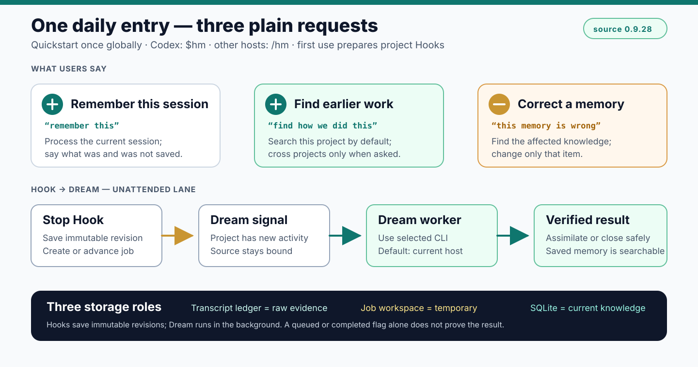
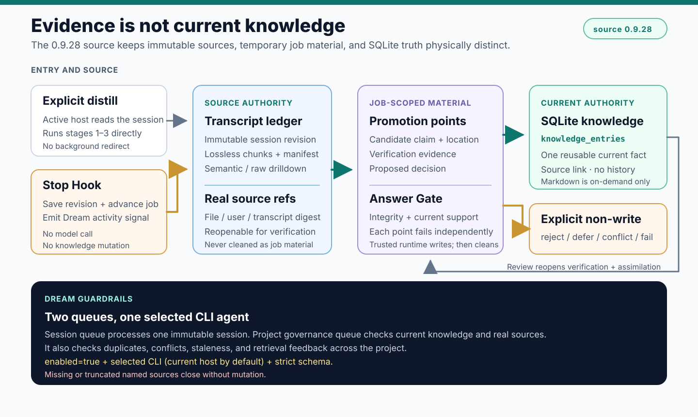
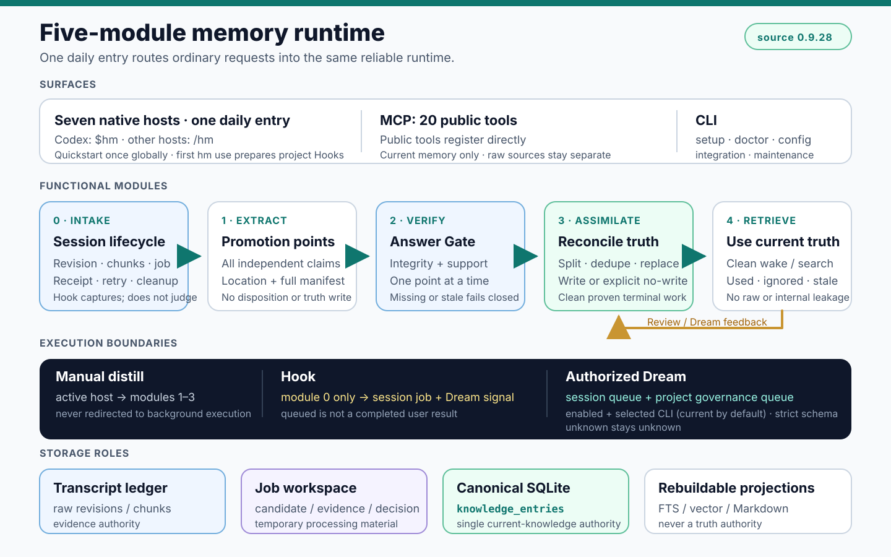

<p align="center">
  
</p>

<h1 align="center">harness-mem</h1>

<p align="center">
  <strong>Local-first, auditable, pluggable memory backend for AI Agents.</strong>
</p>

<p align="center">
  <a href="README.zh-CN.md">简体中文</a>
</p>

<p align="center">
  <a href="https://github.com/manhua-man/harness-mem/actions/workflows/public-smoke.yml">
    
  </a>
</p>

AI Agents can read your repo, but they usually do not know what happened in the
last ten sessions: release boundaries, decisions, handoffs, review outcomes,
and "do not claim this yet" rules.

`harness-mem` turns that project memory into a local backend exposed through
one MCP memory surface. Codex, Claude Code, Cursor, Gemini CLI, and other Agent
clients recover context with `wake` and task-aware `search`, distill recent
session evidence, auto-promote low-risk memory, keep human review as a
post-hoc audit/undo surface, and let dream maintain the ledger.

Invocation surfaces:

- `/hm:*` commands: `status`, `wake`, `search`, `distill`, `review`, `dream`.
- Agent MCP calls: plain language, skills, or hooks trigger `wake/search/distill/review`.
- Hooks: inject wake context and stage transcript evidence for the next Agent-led distill pass.
- CLI: setup, doctor, config, integration, and maintenance only.

<p align="center">
  
</p>

## Core Loop

```text
wake -> search -> distill -> review -> dream
```

| Step | Job |
|---|---|
| `wake` | Load a compact project brief from readable memory at session start. |
| `search` | Retrieve prior decisions, rules, and handoffs when `autopilot_search_tick` detects concrete uncertainty, conflict, tool failure, durable-claim grounding, or a long-horizon task switch. |
| `distill` | Turn recent session evidence into candidates, run shared auto-review, then trigger Dream. |
| `review` | Audit, confirm, reject, undo, or supersede auto-promoted and pending items after the fact. |
| `dream` | Maintain the ledger, compact stale state, and keep reversible cleanup metadata current after save points or session end. |

The runtime search scheduler is event-driven, not always-on. PI-style
`transformContext`, `tool_result`, and `prepareNextTurn` events map directly to
`autopilot_search_tick`; Claude Code `PostToolUse` and Cursor after-agent hooks
can send the same event payload shape. `/hm:search` remains the manual fallback
when a client cannot expose those hooks. `prepare_session_distill` packages
recent evidence; it does not synthesize candidate truth by itself.
Stop hooks persist a pending distill task; the next Agent-capable wake consumes
it. `/hm:distill` is the immediate entry to that same pipeline.

## Why It Is Different

- Local-first: project memory stays on your machine by default.
- Agent-ready: MCP is the normal integration path for coding tools.
- Reviewable: low-risk memory can be auto-promoted, while risk, evidence, and undo metadata stay auditable.
- Pluggable: use it from Codex, Claude Code, Cursor, Gemini CLI, or any MCP-capable Agent client.

<p align="center">
  
</p>

`harness-mem` stays behind the Agent client. MCP is the transport; the runtime
owns storage, candidates, review, retrieval, and local audit state.

<p align="center">
  
</p>

## Install

```bash
pip install harness-mem
```

Optional local vector / hybrid search dependencies:

```bash
pip install "harness-mem[hybrid]"
```

Claude Code users can install the repo-local plugin and optionally register MCP:

```powershell
git clone https://github.com/manhua-man/harness-mem.git
cd harness-mem
.\plugins\harness-mem\scripts\install.ps1 -WithHybrid -RegisterClaude
```

For Cursor, register a project-scoped MCP server that runs from the workspace:

```json
{
  "command": "python",
  "args": ["-m", "harness_mem.mcp.server"],
  "cwd": "${workspaceFolder}",
  "env": {
    "HARNESS_MEM_CLIENT": "cursor"
  }
}
```

On first MCP initialization, harness-mem adopts the workspace, creates its
project profile, and installs the matching Cursor hooks without overwriting
existing files. Users do not run a hook installer. If hooks are missing, the
next MCP initialization repairs the project-local installation without
overwriting existing files. See
[docs/ide-hook-adapter-matrix.md](docs/ide-hook-adapter-matrix.md) for the
current adapter surface and install model for each host.

Then use the Agent-facing commands:

```text
/hm:status
/hm:wake
/hm:search "release boundary"
/hm:distill <project> 10
/hm:review
/hm:dream
```

The terminal CLI is an operator console, not the daily memory workflow. Its
top-level surface is `init`, `quickstart`/`qs`, `doctor`, `config`,
`integration`, and `maintenance`. Import and purge operations live under
`harness-mem maintenance ...` and default to dry-run previews.
Other CLI maintenance actions stay limited to operator repair and audit tasks
such as index rebuilds, storage migration/export, and state audit.
Procedural skill lifecycle management is outside the public memory MCP and CLI
product surface.

## Repository

- `harness_mem/`: runtime package.
- `plugins/harness-mem/`: Agent client integration.
- `tools/session-distill/`: reference session distillation skill.
- `docs/quickstart.md`: minimal setup path.
- `docs/mcp-setup.md`: MCP setup notes.
- `docs/demo-cold-start.md`: reproducible cold-start demo.
- `docs/assets/`: logo and public README diagrams.

## Documentation

- [Quickstart](docs/quickstart.md)
- [IDE hook adapter matrix](docs/ide-hook-adapter-matrix.md)
- [MCP setup](docs/mcp-setup.md)
- [Cold-start demo](docs/demo-cold-start.md)
- [Recall audit contract](docs/recall-audit.md)
- [Autopilot search policy](docs/autopilot-search-policy.md)
- [Memory adoption: optional helpers (analysis)](docs/memory-adoption.md)
- [Agent memory & retrieval research (2026)](docs/agent-memory-retrieval-research-2026.md)
- [Roadmap](docs/roadmap.md)
- [Changelog](CHANGELOG.md)

## Development Check

```bash
python -m compileall harness_mem
python -m ruff check harness_mem plugins tools
python -m pytest tests/test_mcp_exported_tools.py -q
python -m harness_mem.cli --help
cargo test --workspace
```

Repair or regenerate MCP descriptors when `tool_specs` changes (also reverts incidental `mcps/grok_com_github` IDE drift):

```bash
python scripts/ensure_mcps_canonical.py
```

## Releases

- Package version is pinned in `pyproject.toml` and summarized here after each release.
- Tag pushes matching `v*` run [`.github/workflows/release-wheels.yml`](.github/workflows/release-wheels.yml), which builds six native wheels and an sdist, verifies fresh installs on Windows/macOS/Linux, attaches distributions to the GitHub Release, and publishes to PyPI through OIDC.

Current package version: **0.8.23.2**.
