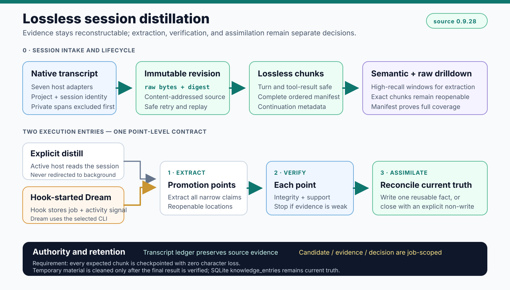

<p align="center">
  
</p>

<h1 align="center">harness-mem</h1>

<p align="center">
  <strong>local-first、可审核、可插拔的 Agent 记忆后端。</strong>
</p>

<p align="center">
  <a href="README.md">English</a>
</p>

<p align="center">
  <a href="https://github.com/manhua-man/harness-mem/actions/workflows/public-smoke.yml">
    
  </a>
</p>

Agent 会读代码，但它通常不知道项目为什么变成现在这样：发布边界、历史决策、handoff、上轮 review 结论、哪些 claim 还不能写。

`harness-mem` 把这些内容变成本地记忆，通过单一 MCP memory surface 接给 Claude Code、Codex、Cursor、Grok、Hermes、OpenCode 和 Antigravity。新 Agent 用 `wake` 和按任务触发的 `search` 找回上下文，用 `distill` 整理近期 evidence，低风险内容可自动提升为可读记忆；`review` 负责人工审计、纠错和 undo，`dream` 负责发现过期、重复、冲突、可合并或可替代的知识，并将其送回验证与归纳吸收。

触发入口（用户级安装一次，之后所有项目可见）：

- `/hm:*` 命令：`status`、`wake`、`search`、`search-all`、`distill`、`review`、`dream`。
- Agent MCP 调用：自然语言、skill 或 hook 触发 `wake/search/distill/review`。
- Hook：会话开始注入 wake context；Stop 前台只同步并排队，随后由 detached autonomous worker 按顺序处理最多 2 条 durable job。当前 Stop 会话固定占第一个优先槽，剩余 backlog 槽再遵循 3:1 recent/oldest 公平补位和每日 backlog 上限。后台 provider 使用无工具 Structured Output、review lease 和失败退避；缺少 provider/auth 时保持显式 retryable，绝不伪报完成。
- CLI：只做 setup、doctor、config、integration 和 maintenance。

日常使用只需要三个意图：用 `wake/search` 继续工作，把可复用结果记住，或
review/undo 一条错误记忆。Dream 是核心治理反馈能力，通常由运行时触发，
不是用户每天必须手工完成的检查清单；status 是诊断汇总入口。

<p align="center">
  
</p>

## 架构与日常动作

### 架构主链（五个可独立迭代的功能模块）

```text
0. 会话接入与生命周期
→ 1. 提取
→ 2. 逐点验证
→ 3. 归纳吸收
→ 4. 检索使用
```

阶段 0 负责宿主接入、授权、不可变 revision、无损 chunk、任务、回执、重试和安全保留/清理源文件；阶段 1--4 决定并使用项目知识。一场会话可以有 0～12 个独立晋升点，验证与归纳均以单点独立进行。

### 核心治理反馈环

Dream 与 Review 是贯穿阶段 3--4 的核心治理反馈能力，不是线性第六阶段，也不是普通运维：

```text
4. 检索使用 → 有用 / 忽略 / 误导 / 过期反馈
             → review / dream → 重新验证 → 归纳吸收
             → 当前长期知识
```

### 贯穿全程

审计回执、纠错、维护、反馈和回滚贯穿每个模块：阶段 0 的接入/任务回执、阶段 1 的提取覆盖、阶段 2 的验证证据、阶段 3 的吸收决定与历史关系，以及阶段 4 的检索使用反馈。

### 用户动作映射

用户动作映射到这些模块，而不是替代这些模块：

| 动作 | 作用 |
|---|---|
| `wake` | 会话开始从可读记忆生成项目简报。 |
| `search` | 当 `autopilot_search_tick` 检测到具体不确定性、冲突、工具失败、待写入 durable claim 需要 grounding、或长周期任务切换时，找回历史决策、规则和 handoff。 |
| `distill` | 编排阶段 1～3。 |
| `review` | 核心人工治理反馈：审计、确认、拒绝、undo、纠错或替代，并在需要时回到验证与归纳。 |
| `dream` | 核心自动治理反馈：发现过期、重复、冲突、可合并或可替代的知识，并送回验证与归纳。 |
| `status` | 汇总阶段 0～4 的真实状态。 |

Hook、detached worker 和 archive maintenance 属于阶段 0；原文/时间线读取、候选明细、运行时重置和存储修复属于显式审计或运维能力，不定义长期知识模型。

质量问题也必须按模块定位，不能笼统归因于“蒸馏失败”：

```text
漏知识 → 1. 提取问题
错知识 → 2. 验证问题
垃圾/重复/太宽 → 3. 归纳吸收问题
找不到或返回脏内容 → 4. 检索使用问题
会话丢失、回执不可靠、源误删 → 0. 会话接入与生命周期问题
```

每个模块的处理单位、负责范围、不负责范围和质量衡量，见
[五模块架构合同](docs/memory-adoption.md)；[验收测试计划](docs/distill-test-plan.md)
将这些质量信号逐项映射到夹具和运行时门槛。

当前发布的 `0.9.22` 已把 SQLite `knowledge_entries` 收敛为干净当前知识的唯一权威；
候选、验证与拟议决定是 job 范围临时材料，只在终态结果得到证明后清理，兼容
`MemoryEntry` 旧行仍可读取。当前搜索直接、确定性地读取 SQLite；FTS/向量只是可选的
可重建优化。Markdown 只在用户请求阅读或导出时生成。项目模块由当前知识自然归纳，
不使用硬编码模块白名单。冻结的六会话验收已通过；其他真实旧记忆范围仍需单独明确授权。详见
[SQLite 当前知识收敛计划](docs/roadmap/knowledge-truth-separation.md)。

任务过程中的检索不是 always-on。PI 里的 `transformContext`、
`tool_result`、`prepareNextTurn`，Claude Code 的 `PostToolUse`，以及
Cursor 的 after-agent hook，都应映射到同一个 `autopilot_search_tick`
事件入口；`/hm:search` 只是客户端没有这类 hook 时的手动兜底。
`Stop` Hook 会保存不可变的原始 transcript revision，并排队它的全部有序 chunk。日常 `prepare_session_distill(evidence_mode="semantic", detail_level="compact")` 保留完整原文，由 runtime 校验并 checkpoint 每个 raw chunk，再返回包含全部 exchange 索引和风险信号的 compact manifest。预算约束的是 provider 实际接收的完整序列化响应，3k 只是兼容默认软目标；允许因完整覆盖或显式 drilldown 扩张，但 `response_budget` 必须报告真实 token 数与原因，绝不静默丢弃后半段 exchange。detached worker 默认通过当前 Responses provider 做无工具、`store=false`、严格 JSON Schema 的语义审查；受信 runtime 随后治理候选、finalize，并原子生成 `~/.codex/hm-distill/sessions/<session-id>.md`。健康状态持久化真实 token/耗时及 `last_semantic_success_at`、`last_job_completed_at`、`last_note_materialized_at`。`detail_level="full"` 与兼容 `raw` 模式仍用于显式完整审计。检测到 decision、solution、preference、workflow、migration 或 handoff 信号时默认 fail-closed 为 `candidate_required`；只有读完完整窗口并给出针对该信号的 session-only 理由才能降级。`finalize_session_distill` 对当前 job 执行 scoped 自动治理并记录 `promoted` 或 `no_candidate`。`/hm:review` 是纠错和 undo 入口，不是日常晋升闸门；`/hm:distill` 是同一条可恢复管线的立即执行入口。同步 Hook 本身只可声称已排队，只有 finalize 与 Note 回执都落盘后后台才可声称完成；没有原始 transcript 的旧 Observation 仅供审计，标记为 `legacy_partial`。

显式 `raw` 审计中的每个 raw chunk 都保留完整内容，不截断内容。

后台语义处理会把 compact manifest 发送给当前配置的模型 provider，并可能消耗
quota，因此必须由需要自动处理的项目单独授权：

```bash
harness-mem config set distill.autonomous.enabled true --scope project --confirm
```

全局默认是 `false`；授权后该项目的 Stop 不再重复确认，未授权项目保持仅排队模式。

新候选带 evidence basis 和 verification outcome。仓库事实必须引用
当前项目相对文件及其 SHA-256；用户偏好或决定引用 user role 的 exchange
摘要。只有 transcript 说法、证据缺失/变化或已冲突的候选不能进入长期 truth；
RelationFact 也走同一准入规则，旧 truth 不会被追溯重分类。

0.9.6 在不改变主流程的前提下收敛了安装面：MCP schema、handler、cluster 和
descriptor 注册表严格对应同一组 27 个公开工具；七宿主 hook 修复统一为一个
命令；公开配置只保留 11 个持久策略选择，旧 tuning 值仍可兼容读取。

0.9.9 不增加第二条产品路径，而是在现有边界上加固：有界的重启恢复、派生索引
原子重建、七宿主原生回放，以及安装、升级和恢复验收，都继续复用本地 SQLite、
Adapter、Dream 和 Doctor。详细回放指标只进入维护工件；日常 wake、status 和
distill 仍保持 compact。

Observation 只是证据，不是被记住的事实。wake 的近期索引会明确标成“非事实证据”；L1/L2 只展示结构化当前事实和仍有效的 handoff。被当前仓库版本推翻的旧发布/版本说法会标记冲突，或从 truth/active 层移除。

隐私策略在落盘前执行：可用 `<private>...</private>` 包裹敏感片段，也可在项目 `.harness-mem.toml` 的 `[capture]` 中配置忽略 client、session 和 source glob；被排除内容不会进入 raw revision、chunk、Observation 或索引。`[transcript].retention_days` 控制自动保留期（`0` 表示永久保留）。成功蒸馏后默认保留原始来源；只有项目配置通过 `harness-mem config set distill.delete_source_after_complete true --scope project --confirm` 显式授权，并且适配器支持会话级删除且静默/CAS/hash 校验全部通过时才会删除。用户级配置不能授权该破坏性策略。共享或不安全容器保持不动并报告 `unsupported`，配置不可读、项目值缺失或项目无法解析时也会 fail-safe 保留。canonical SQLite 中的当前长期知识会保留并脱敏，Markdown 仅在阅读或导出时按需生成；每次结果明确为 `retained`、`deleted`、`partial_failure` 或 `unsupported`。`harness-mem maintenance erase --project NAME --session-id ID` 仍是显式完整擦除入口，默认预览，增加 `--apply` 后才执行。

Codex 归档任务先绑定项目根；`archive_distill.project_scope` 默认就是
`"current"`，只处理当前项目。跨项目处理必须显式设置为 `"all"`。先只读盘点，
再按公开策略处理一批：

```bash
harness-mem maintenance archive-distill --dry-run --project-root .
harness-mem maintenance archive-distill --apply --verify --json --project-root .
```

`[archive_distill]` 配置批大小、每日上限、顺序、项目 scope、无法归属的处理方式、token/耗时警戒线、Answer Packet 强制要求和逐条晋升报告；不再提供项目白名单。正式 Answer Packet 会记录原问题、核心结论、证据、验证时间、晋升状态、目标项目/分类以及每条晋升事实。内部有效预算和 Dream 时间参数可用 `harness-mem config list --detail runtime` 只读查看。

`--verify` 复用同一个已初始化 backend，一次生成带 `run_id` 的持久化回执，覆盖 job/Answer Packet、Note、daily ledger 防重放、晋升知识检索和源清理审计。精确回显型 smoke 会话由确定性规则判定为无长期知识，不调用模型。

已验证终态会按精确 source revision 跨 UTC 日期持久化，因此 retained 归档不会
再次调用 Provider。若 completed job 的历史回执是 partial，即使安全清理已经删除
原生源文件，也可以只读修复而不重新做模型调用：

```bash
harness-mem maintenance archive-distill --apply --verify --repair-only --project-root .
```

一次性排空可用 `--batch-size`、`--daily-limit` 仅覆盖本轮，不修改项目默认值。
apply 必须保持单进程，因为 transcript store、终态索引、回执和清理链共享排他维护锁。
遇到非 passed 验证立即停批；completed job 只读回，未完成 job 最多再做一次语义尝试，
仍失败则保留源文件并进入 quarantine。终态报告会把全部会话守恒归入 verified、
pending、quarantined、deferred-unresolved 或 excluded。

旧 entity JSON reader 从 0.9.6 起弃用，但完整支持整个 0.9.x；最早删除门槛同时为 1.0.0 和 2027-01-31，以更晚者为准。旧数据只读启动不会静默切换存储权威，详见 [legacy storage lifecycle](docs/storage-legacy-lifecycle.md)。

运维诊断同样显式：Doctor 只读探测 SQLite，并把恢复动作分成 `safe_rebuild`、`snapshot_required`、`manual_review` 和 `destructive`，不会自动 apply。compact project status 保留决策信息；full drilldown 增加 7 天检索使用/忽略/误导/放弃/旧冲突排除统计，以及明确的 distill backlog 原因和基于 Agent 实际吞吐的保守清空估算。

<p align="center">
  
</p>

## 关键机制

Agent 可以自动处理低风险候选，但不能把风险、证据和变更原因藏起来；用户 review 的对象是 audit inbox，不是日常逐条写入闸门。

<p align="center">
  
</p>

运行时本身保持在后端位置：上层 Agent 走 MCP，底层是 canonical SQLite 当前知识、job 范围处理材料和可重建索引；Markdown 只在阅读或导出时生成。

<p align="center">
  
</p>

## 它解决什么

- 新 Agent 不必每次从零翻旧聊天。
- 长期项目里的决策、约定、handoff 和 review 结论可以被检索。
- 写入默认先进入 candidate layer，避免把猜测、噪声、临时结论变成真值。
- 同一套本地记忆后端可以接到 Claude Code、Codex、Cursor、Grok、Hermes、
  OpenCode、Antigravity 或其它 MCP-capable Agent。

## 安装

```bash
python -m pip install \
  --find-links https://github.com/manhua-man/harness-mem/releases/expanded_assets/v0.9.22 \
  harness-mem==0.9.22
```

`harness-mem` 本体通过 GitHub Releases 分发。上述命令会自动选择适用于
Windows、macOS 或 Linux 的原生 wheel，不需要 PyPI 项目或账号。

需要本地 vector / hybrid search 可选依赖：

```bash
python -m pip install \
  --find-links https://github.com/manhua-man/harness-mem/releases/expanded_assets/v0.9.22 \
  "harness-mem[hybrid]==0.9.22"
```

在当前设备一次性安装全部宿主的原生 Daily 命令。默认参数就是
`--client all --scope user`：

```bash
harness-mem integration commands sync
```

该命令只写各宿主的用户级 command、skill 或 workflow 目录，不安装项目
hooks，也不会把某个项目路径固化到全局命令中。

Claude Code 用户可以安装 repo-local plugin，并可选注册 MCP：

```powershell
git clone https://github.com/manhua-man/harness-mem.git
cd harness-mem
.\plugins\harness-mem\scripts\install.ps1 -WithHybrid -RegisterClaude
```

Cursor 请在项目 MCP 配置中使用 `harness-mem-mcp`，将 `cwd` 设为工作区，
并设置 `HARNESS_MEM_CLIENT=cursor`。首次 MCP 初始化会自动认领工作区、创建
project profile、安装匹配的项目 hooks，并幂等修复当前宿主的用户级命令；
不需要用户运行 hook installer，也不需要逐项目同步 command。完整配置
见 [MCP setup](docs/mcp-setup.md)。

需要显式修复时，七宿主统一使用
`harness-mem integration hooks sync --client all --project-root . --force`；
只修复一个宿主时，再把 `all` 换成对应宿主名。

仓库安装脚本会自动执行同一套“全部宿主、用户级”同步：

```powershell
.\plugins\harness-mem\scripts\install.ps1 -WithHybrid
```

所有已支持宿主使用同一组动作：`status`、`wake`、`search`、`search-all`、
`distill`、`review`、`dream`。Claude Code 使用 `/hm:<action>`；Codex 使用可显式
调用的 `$hm-<action>` skill；Cursor、Grok、Hermes、OpenCode、Antigravity 使用
`/hm-<action>`。Codex 不支持注册自定义 slash command，因此 `$hm-*` 是它的原生命令形式。
用户级目录分别是：Claude Code `~/.claude/commands/hm`、Codex
`~/.codex/skills`、Cursor `~/.cursor/skills`、Grok `~/.grok/skills`、
Hermes `$HERMES_HOME/skills`（原生 Windows 默认为
`%LOCALAPPDATA%/hermes/skills`）、OpenCode `~/.config/opencode/commands`、
Antigravity `~/.gemini/antigravity/global_workflows`。
生成命令会按逻辑工具名解析当前 MCP namespace：直连 `harness_mem` 与通过
MCP Router 接入时，内部前缀可以不同，但用户入口不变。修改 MCP 注册或更新
工具 schema 后，需要重启对应 server 并新开 task，旧 task 不会热更新工具清单。

`codex-archive` 只是 Codex 历史归档会话的兼容 source identifier，不是第八个
宿主。旧配置和既有记录仍可读取，但 capability、status 和 qualification 统计
都会把它归入 Codex。

终端 CLI 是 operator console，不是日常 memory workflow。顶层只保留
`init`、`quickstart`/`qs`、`doctor`、`config`、`integration` 和
`maintenance`。导入和清理走 `harness-mem maintenance ...`，默认都是
dry-run 预览。
其它 CLI 维护动作只保留 operator repair / audit 所需的索引重建、storage
迁移/导出和状态审计。
procedural skill 生命周期治理不属于 public memory MCP 和 CLI 产品面。

## 仓库结构

- `harness_mem/`：runtime package。
- `code/plugins/harness-mem/`：Agent 客户端接入层。
- `code/tools/hm-distill/SKILL.md`：正式 MCP distill 主链的纯 Agent 指令；全部 runtime 实现统一位于 `harness_mem/`。
- `docs/quickstart.md`：最小启动路径。
- `docs/mcp-setup.md`：MCP client 接入说明。
- `docs/demo-cold-start.md`：可复现 cold-start demo。
- `docs/assets/`：logo 和公开 README 图。

## 文档

- [Quickstart](docs/quickstart.md)
- [MCP setup](docs/mcp-setup.md)
- [Cold-start demo](docs/demo-cold-start.md)
- [Recall audit contract](docs/recall-audit.md)
- [自动检索策略](docs/autopilot-search-policy.md)
- [Compatibility inventory](docs/compatibility-inventory.md)
- [参考项目证据目录](docs/reference-projects/index.md)
- [Roadmap](docs/roadmap.md)
- [Changelog](CHANGELOG.md)

## 开发检查

```bash
python -m compileall harness_mem
python -m ruff check harness_mem code/plugins code/tools
python -m mypy harness_mem
python -m pytest -q -m "not release_gate"  # PR 快速门
python -m pytest -q                        # 完整发布门
python -m harness_mem.cli --help
cargo test --workspace
```

快速门只跳过四个确定性的 60-case 穷举检索回放；全部断言仍会在 `main`
和正式 tag 的发布门中执行。

在声称运行中的产品已经完成前，使用跨项目 `outcome-verifier` Skill 执行
仓库的用户结果合同：

```bash
python code/tools/outcome-verifier/scripts/verify_outcomes.py \
  --config .codex/outcomes.json \
  --output .tmp/outcome-verifier/harness-mem-report.json
```

verifier 会按输出路径获取排他锁，并以原子替换方式发布最终报告，因此第二次
并发运行不能覆盖正在生成的证据。报告包含 run ID 和每项检查耗时。只诊断
autonomous 状态时，不必输出完整 Note 清单：

```bash
python -m harness_mem.outcome_probe \
  --project harness-mem \
  --project-root . \
  --client codex \
  --section autonomous \
  --compact
```

IDE Hook 默认仍为非阻塞。人或 Agent 可把包含 `session_id` 或 `turn_id` 的真实
Codex Hook payload 通过 stdin 传入，并显式等待 detached post-turn 回执：

```powershell
'{"session_id":"<codex-session-id>"}' |
  harness-mem-hook --adapter codex-stop --project-root . --wait --wait-timeout 120
```

命令返回终态 JSON；身份缺失、deferred、failed 或超时时返回非零退出码。
等待同时绑定 Hook 身份与本次后台 dispatch generation；带错误的回执即使状态字段为
`succeeded` 也会失败。缺少 Hook 身份的 `--wait` 会立即失败，不再空等一个无法绑定的回执。

该只读探针要求：Codex 生命周期的 start/Stop 回执新鲜且成对、Dream 存在
持久化成功运行、最近完成的每个蒸馏会话都有有效语义摘要和可读 Note，以及
至少一条长期记忆能从 FTS read model 真正检索回来。只要 verdict 非零，就不能
因为代码、配置、队列或单元测试正常而声称用户结果已经落地。

发布标签会构建六个平台 wheel 和 sdist，在 Windows、macOS、Linux 上完成
全新安装验证，运行真实 sqlite-vec contract gate，并验证受支持的 Windows 升级
路径后再上传到 GitHub Release。本项目不发布到 PyPI。

当前包版本：**0.9.22**。
