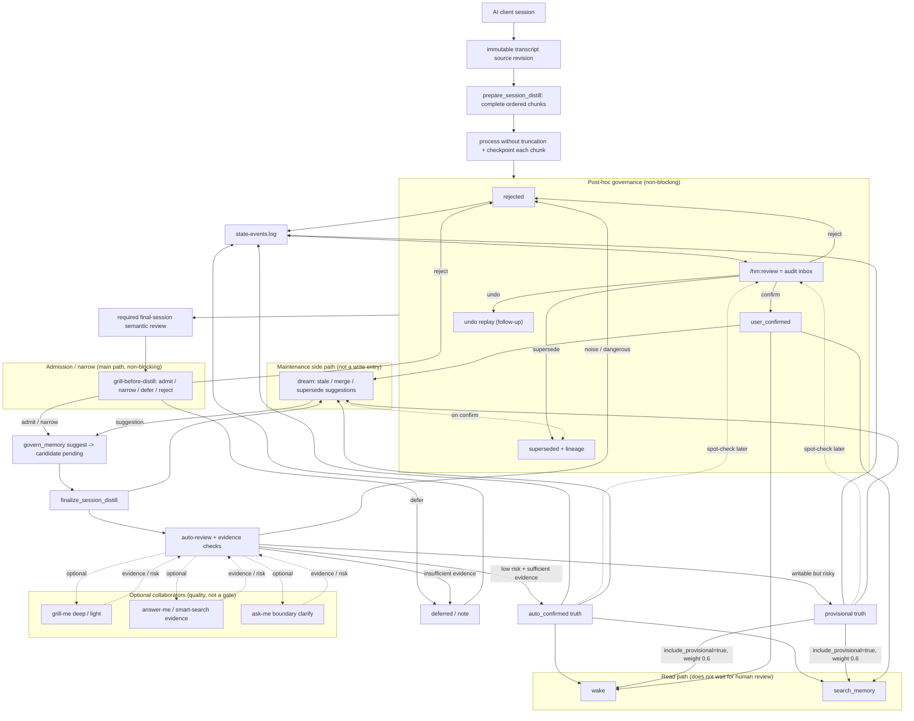
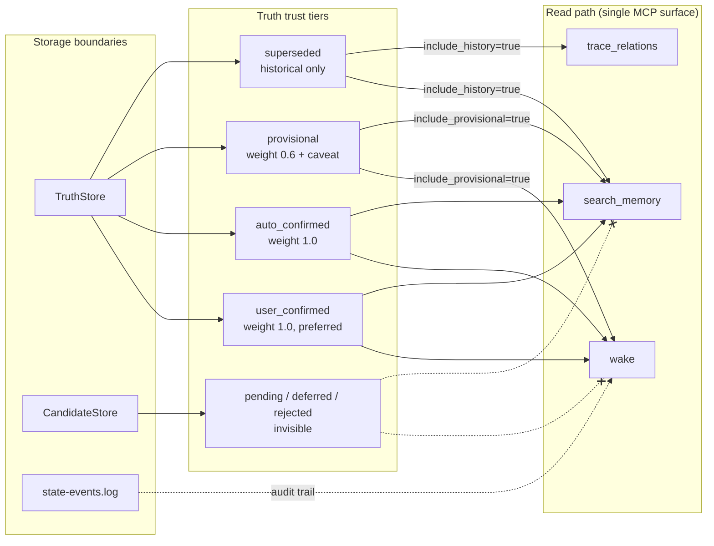

# Auto-Promoted Memory Governance

Reference for the **0.9.x governance model**: auto-promoted truth with post-hoc
audit and one public write boundary. Runtime code lives in `harness_mem/governance_status.py`,
`commands/auto_review.py`, read-path filters, and `state-events.log`.

The public MCP write API is `govern_memory`; the former per-kind write-tool
schemas and registry entries are retired. Their private implementations remain
behind the composite boundary. Remaining follow-up is audit-inbox UX polish
and measured long-running drainer telemetry.

```text
immutable source revision -> complete ordered chunks -> final-session review
  -> idempotent candidate -> finalize_session_distill -> auto_confirmed / provisional truth
  -> ledger -> /hm:review audit -> user_confirmed
```

The source revision is the authoritative session record. Observations are
derived search material, not a substitute for transcript text or proof that
distillation completed.

`/hm:review` is an **audit inbox**, not a write gate. Helpers (grill, answer,
smart-search, `auto_review_candidates`) improve write quality on the main path;
human review is post-hoc governance.

---

## Layered statuses (not eight parallel enums)

Seven governance statuses are grouped by **storage layer**. Runtime routes by
layer; callers do not pick a layer manually.

| Layer | Statuses | Role |
|---|---|---|
| **Candidate** | `pending`, `deferred`, `rejected` | Not wake/search truth |
| **Truth** | `auto_confirmed`, `provisional`, `user_confirmed` | Readable truth (weight differs) |
| **Historical** | `superseded` | Lineage / `include_history` only |

Maintenance review candidates (dream supersede / merge / stale / procedural) use
a separate status set (`pending`, `rejected`, `user_confirmed`) — not memory
truth-layer transitions.

Core requirement: **auto-written truth and human-audited truth must not share one
trust tier.** `auto_confirmed` and `user_confirmed` stay separate for wake
weighting and audit accountability.

---

## End-to-end flow



Notes:

- Hooks capture immutable source revisions and queue complete chunk sets. They
  do not perform session summarization or candidate promotion.
- `prepare_session_distill` returns bounded chunks without truncation. Each
  completed chunk has a durable checkpoint, and candidate creation waits for a
  required final-session review after all expected chunks are complete.
- Candidate writes are idempotent for retries of the same source revision.
- `finalize_session_distill` rechecks source revision and chunk completeness,
  then runs auto-review and Dream. Auto-review promotes on the main path; public
  MCP applies promotions directly (no preview-only enforcement).
- Every promotion appends to `~/.harness-mem/data/state-events.log`.
- `govern_memory(action="decide", decision="confirm")` upgrades truth to
  `user_confirmed` (highest trust tier).

---

## Governance statuses

| Status | Layer | Meaning | wake / search |
|---|---|---|---|
| `pending` | Candidate | Created; preflight not finished | excluded |
| `deferred` | Candidate | Insufficient evidence; not usable memory | excluded |
| `rejected` | Candidate | Noise or dangerous conclusion | excluded |
| `auto_confirmed` | Truth | Low risk, sufficient evidence; auto-promoted | full weight |
| `provisional` | Truth | Written with risk flags | opt-in via `include_provisional`, weight 0.6 |
| `user_confirmed` | Truth | User audited later; highest trust | full weight, preferred |
| `superseded` | Historical | Replaced; lineage only | `include_history` only |

---

## State machine

```mermaid
stateDiagram-v2
    [*] --> pending: govern_memory suggest / dream suggestion

    pending --> deferred: preflight insufficient evidence
    pending --> rejected: preflight noise or danger
    pending --> auto_confirmed: preflight low-risk pass
    pending --> provisional: preflight pass with risk flags
    pending --> user_confirmed: govern_memory confirm without auto promote

    auto_confirmed --> user_confirmed: /hm:review or govern_memory confirm
    provisional --> user_confirmed: /hm:review or govern_memory confirm
    provisional --> rejected: reject or undo

    auto_confirmed --> superseded: dream or user supersede
    provisional --> superseded: dream or user supersede
    user_confirmed --> superseded: dream or user supersede

    deferred --> pending: evidence added; retry preflight
    deferred --> rejected: audit cleanup

    rejected --> [*]
    superseded --> [*]: historical lineage only
```



Pure transition rules: `harness_mem/governance_status.py::validate_status_transition`.

---

## Read path: wake / search trust tiers



Shipped foundation (0.8.11), converged public API (0.9.1):

- Default list/search filter is `readable_truth` (`READABLE_TRUTH_FILTER`):
  `auto_confirmed` + `user_confirmed` at full weight.
- `include_provisional=true` adds `provisional`; search applies
  `governance_weight=0.6` in result metadata.
- `wake` and `search_memory` accept `include_provisional` via
  `orchestrate_task_context` → `SearchFilters`.
- New promotes write `auto_confirmed`; explicit
  `govern_memory(action="decide", decision="confirm")` writes `user_confirmed`.
  Candidate-layer defaults for new rows are `pending`.

---

## Follow-up slices

| Slice | Role |
|---|---|
| **dream full chain** | Align stale / merge / supersede maintenance with seven-status promote and lineage |
| **undo replay** | Revert governance transitions from `state-events.log` |
| **/hm:review inbox UX** | Inbox-style audit over `provisional` / `auto_confirmed`, not a pre-write gate |

---

## Related docs

- [recall-audit.md](recall-audit.md) — read-path recall contract
- [autopilot-search-policy.md](autopilot-search-policy.md) — automatic wake/search/distill/review trigger policy
