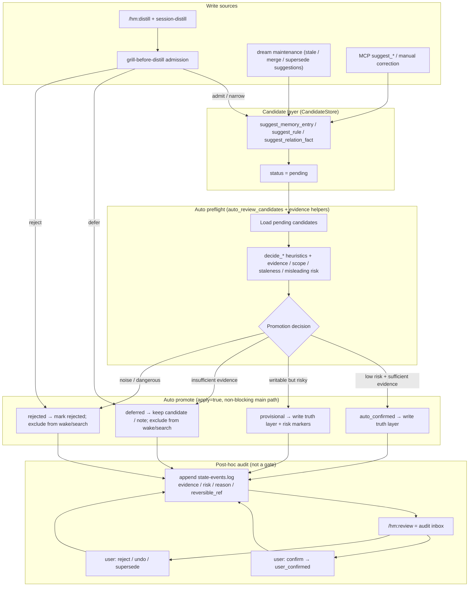
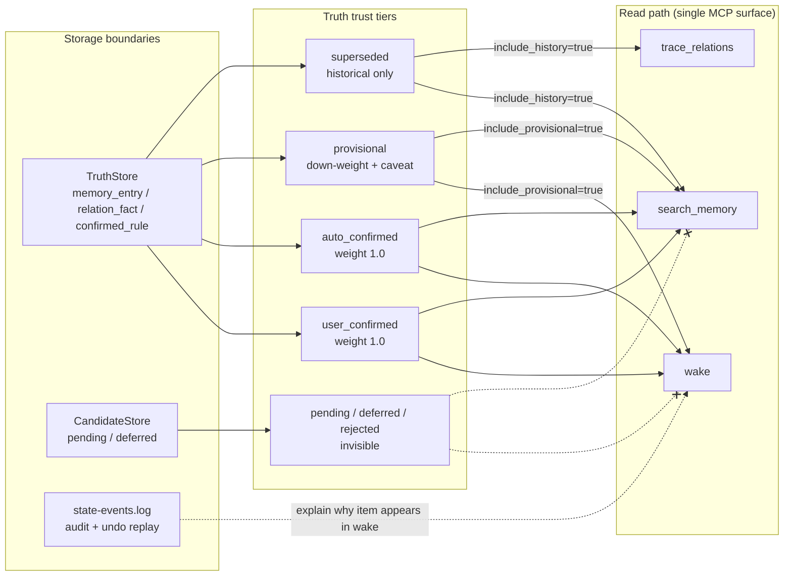

# Auto-Promoted Memory Governance (Design)

Design reference for the **0.8.8+ auto-promoted governance slice**. Runtime
code in `harness_mem/governance_status.py`, `commands/auto_review.py`, and
read-path filters implements the first pass; dream undo replay and full audit
inbox UX remain follow-up work.

Current runtime (0.8.x):

```text
observation -> candidate -> auto preflight -> auto_confirmed / provisional truth
                              -> ledger -> /hm:review audit/undo -> user_confirmed
```

Legacy mental model:

```text
observation -> candidate -> review gate -> accepted truth
```

`/hm:review` becomes an **audit inbox**, not a write gate. Automatic helpers
(grill, answer, smart-search, `auto_review_candidates`) improve write quality on
the main path; human review is post-hoc governance.

## Governance statuses

| Status | Meaning | wake / search |
|---|---|---|
| `pending` | Candidate created; preflight not finished | excluded |
| `deferred` | Insufficient evidence; not usable memory | excluded |
| `rejected` | Noise or dangerous conclusion | excluded |
| `auto_confirmed` | Low risk, sufficient evidence; auto-promoted | normal weight |
| `provisional` | Written with risk flags | included, down-weighted + caveat |
| `user_confirmed` | User audited later; highest trust | normal weight, preferred |
| `superseded` | Replaced; lineage only | historical / `include_history` |

`auto_confirmed` and `user_confirmed` must stay separate so auto-written memory
does not share the same trust tier as human-audited truth.

## Gap vs current implementation

| Today | Target |
|---|---|
| `MemoryEntry.status`: `pending \| accepted \| rejected` | Extend to seven governance statuses |
| `auto_review_candidates` apply → `accepted` | Promote to `auto_confirmed` or `provisional` |
| Public MCP forces `apply=false` on auto-review | Redefine surface policy for trusted auto-promote |
| `confirm_*` is the only truth path | `confirm_*` upgrades to `user_confirmed` |
| `wake` / `search_memory` filter `status == "accepted"` | Trust-tier filters for auto / provisional / user |

Implementation order: state transition table → schema → `auto_review_candidates`
apply semantics → wake/search filters → ledger/undo contract tests.

---

## 1. Write path and auto-promotion



Notes:

- `grill-before-distill` stays an admission narrow-er (`admit` / `narrow` /
  `defer` / `reject`). Passing preflight auto-writes truth; it does not wait for
  manual review.
- `auto_review_candidates(apply=true)` promotes on the main path instead of
  preview-only handoff to `/hm:review`.
- Every promotion appends to `~/.harness-mem/data/state-events.log` for undo and
  audit replay.

---

## 2. Governance state machine

```mermaid
stateDiagram-v2
    [*] --> pending: suggest_* / dream suggestion

    pending --> deferred: preflight insufficient evidence
    pending --> rejected: preflight noise or danger
    pending --> auto_confirmed: preflight low-risk pass
    pending --> provisional: preflight pass with risk flags

    auto_confirmed --> user_confirmed: /hm:review user confirms
    provisional --> user_confirmed: /hm:review user confirms
    provisional --> rejected: /hm:review reject or undo

    auto_confirmed --> superseded: dream or user supersede
    provisional --> superseded: dream or user supersede
    user_confirmed --> superseded: dream or user supersede

    deferred --> pending: evidence added; retry preflight
    deferred --> rejected: audit cleanup

    rejected --> [*]
    superseded --> [*]: historical lineage only
```



---

## 3. Read path: wake / search trust tiers



Alignment with current code:

- Today `context_assembly.py` loads only `status == "accepted"`.
- Target: `auto_confirmed` and `user_confirmed` enter wake at full weight;
  `provisional` is optional with reduced weight; `superseded` follows existing
  `historical` / `valid_to` lineage.

---

## Related docs

- [recall-audit.md](recall-audit.md) — current read-path recall contract
- [autopilot-search-policy.md](autopilot-search-policy.md) — automatic wake/search/distill/review trigger policy
- [memory-adoption.md](memory-adoption.md) — optional helper layers beside hm
- [roadmap.md](roadmap.md) — version line and shipped scope
