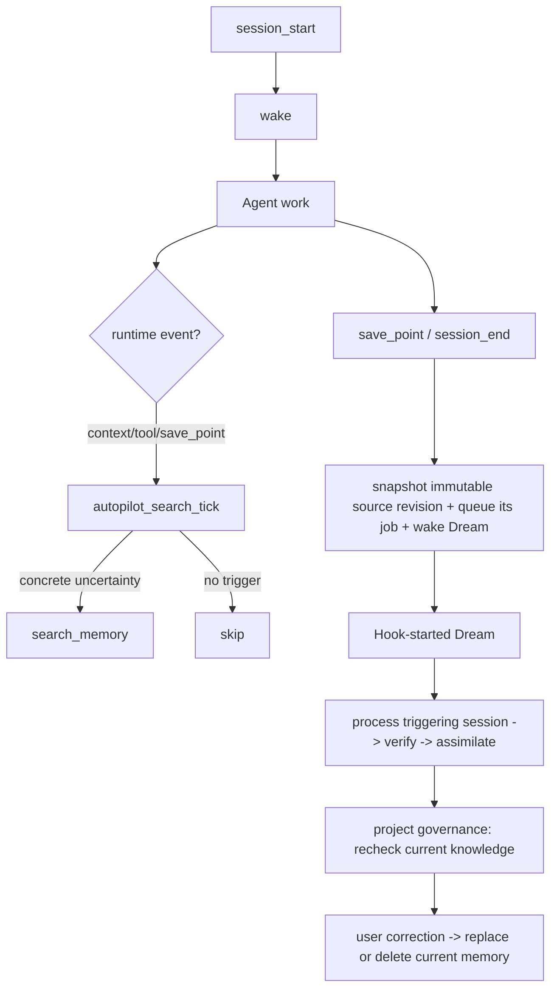

# Autopilot Search Policy

The user has one daily entry: `$hm` in Codex and `/hm` in the other supported
hosts. They can say “remember this session”, “find how we did this before”, or
“this memory is wrong”. The Agent maps that request to the existing runtime;
users do not need to choose `wake`, `search`, `distill`, `review`, or `dream`.
Those internal capabilities do not replace the functional architecture:

```text
session intake and lifecycle -> extraction -> verification -> assimilation
-> retrieval/use
```

Review and Dream are core governance-feedback capabilities across assimilation
and retrieval. The runtime entry for task-aware search is the MCP tool
`autopilot_search_tick`.



The user does not review every item before it can help. The runtime applies the
project rules, keeps the minimum source link needed for checks, and lets the
user correct, replace, or delete current memory later.

The `hm` entry also tells the active Agent to run this scheduler at live task
checkpoints: when a project task starts, before a project-changing action,
after a tool failure or conflict, and before a durable memory write. Ordinary
questions still skip the scheduler's actual search. Host Hooks provide the
session-start `wake` and end-of-turn maintenance; the active Agent provides
these task-time checks even when a host has no separate context or tool-result
Hook.

## Loop Contract

```text
session_start -> wake
context/tool/save_point -> task-aware search
save_point/session_end -> snapshot an immutable source revision + create/advance its job + wake Dream
Hook-started Dream -> read the triggering session + project sources/feedback -> verify + assimilate
explicit "remember this session" -> active host checkpoints chunks -> extract + verify + assimilate
finalize_session_distill -> completeness check + commit for that explicit job only
review -> correction, replacement, or deletion
dream -> discover stale / duplicate / conflicting knowledge -> re-verify and update current memory
```

There are no action-specific daily commands. Operator diagnosis and repair stay
in the terminal CLI or MCP tools instead of creating more entries for users.
When a client has hooks or an Agent extension API, the first `hm` use in a
project prepares the automatic path for that client.

## Client Event Model

Different clients expose different hook names. `harness-mem` should target a
small event model and let installers map it to Claude Code, Cursor, Codex, Pi,
Gemini CLI, or other clients.

| Event | Purpose | Typical mapped hook |
|---|---|---|
| `session_start` | Resolve the workspace project and inject `wake` context. | SessionStart, before-agent-start, first context transform. |
| `context_transform` | Add bounded memory context before an LLM request. | Pi `transformContext`, provider-payload/context hook. |
| `tool_result` | Learn from file/search/test/build outcomes and decide whether extra memory search is useful. | PostToolUse, Pi `afterToolCall`, tool-result observer. |
| `save_point` | Snapshot the settled native transcript as an immutable source revision, queue its complete ordered chunks, and wake Dream. | turn end, message end, after-agent, save point. |
| `session_end` | Flush the current source revision, preserve every queued chunk, and wake Dream; the Hook itself does not summarize. | Stop, SessionEnd, SubagentStop, idle/settled hook. |

The installer should configure every supported event the client exposes. If a
platform lacks hooks, the user invokes `$hm` or `/hm` and states what they want
in ordinary language.

## Runtime Scheduler Contract

`autopilot_search_tick` receives one normalized event payload and returns:

- `decision`: whether search should run, the trigger, bounded query, and skip
  reason when search is not warranted.
- `search`: the normal `search_memory` payload when search runs.
- `context_injection`: source ids, `answer_ready_context`, `context_plan`,
  supporting evidence, drilldown hints, and a suggested
  `record_context_outcome` call for later feedback.

The tool maps agent scheduling events rather than IDE names:

| Agent scheduling point | Native examples | `autopilot_search_tick` use |
|---|---|---|
| Before provider request | Pi `transformContext`, extension `context`, provider payload hook | Search only if the task text contains explicit recall, convention uncertainty, conflict, or long-horizon switch. |
| Before a tool call | Pi `beforeToolCall`, Claude Code `PreToolUse` | Search only for convention/boundary uncertainty before a risky action. |
| After a tool result | Pi `afterToolCall`, Claude Code `PostToolUse`, `PostToolUseFailure` | Search on errors, flaky outcomes, conflicts, or evidence that contradicts known truth. |
| Save point / next turn | Pi `prepareNextTurn`, turn-end/after-agent | Snapshot the current source revision, queue all ordered chunks, and wake Dream. Dream is the unattended executor for that job and project governance. |

Session-start stays `wake`. Session-end captures an immutable native transcript
revision, queues its complete ordered chunk set, and wakes Dream; the Hook
never claims semantic summarization completed. Dream reopens that session and
then performs the same verified assimilation boundary plus project governance.
An explicit “remember this session” request through `$hm` or `/hm` instead
stays in the active host. That separation
keeps Hook work small and the task-aware search policy testable inside
`harness-mem`.

## Search Is Not Always-On

Always injecting search results wastes context and can make stale memory look
more authoritative than the repo. Search should run when the Agent has a
specific retrieval need. In runtime this means `autopilot_search_tick` must
name the trigger before it is allowed to call `search_memory`.

Default triggers:

| Trigger | Query shape | Why it is worth searching |
|---|---|---|
| Explicit recall request | User words plus project name. | The user asked for prior context. |
| Project convention uncertainty | Current task, files, and terms like "convention", "rule", "boundary". | Prevents violating durable repo norms. |
| Conflict or contradiction | Claimed fact plus conflicting current observation. | Finds the current decision that may need correction. |
| Tool failure or flaky result | Tool name, error summary, failing file/test. | Recovers prior fixes and known environment issues. |
| Pre-write durable claim | Candidate memory text plus evidence ids. | Grounds distill before auto-promotion. |
| Long-horizon task switch | New module, branch, feature, release boundary. | Refreshes only the relevant slice, not the whole memory set. |

Do not search just because another turn started, a file was read, or a tool
returned any output. The search trigger should name the uncertainty it is
trying to resolve.

## Trigger Decision

The Agent/client should make a small policy decision before calling
`search_memory`:

```text
1. What am I uncertain about?
2. Can current repo/tool evidence answer it cheaply?
3. Is the uncertainty likely to be covered by current project memory?
4. What bounded query would retrieve only that memory?
5. What budget should the result use in the next context?
```

If the answer to step 3 is no, do not call memory search. If current repo facts
and memory disagree, current repo/tool evidence wins unless memory points to a
specific historical decision that still applies.

## Read Path

Search reads current project knowledge from SQLite `knowledge_entries`.
Job-scoped candidate, evidence, proposed-decision, and pending material never
appear in normal wake/search. Replaced or deleted knowledge is not retained as
searchable history.

The runtime binds each injected result to its current source link and inclusion
reason internally. User-facing wake/search shows only current memory prose;
internal feedback can still record whether the context helped, was ignored, or
misled the Agent.

## Write Path

At save points or session end, the hook/runtime path only:

1. Capture the native transcript as a project-scoped, immutable source revision.
2. Split that complete revision into ordered chunks without truncating any
   character, turn, tool call, or final response.
3. Queue every chunk durably and wake Dream with the new job.

Observations remain derived search aids. They are not the authoritative
transcript source and cannot replace the immutable source revision.

Dream is the sole unattended semantic executor. It reopens the triggering
session, processes its durable chunks, verifies claims, and assimilates only
governed results. It also checks the project's current knowledge, sources, and
feedback for stale, duplicate, or conflicting truth. A “remember this session”
request through `$hm` or `/hm` remains the explicit immediate path in the active
host; it processes the jobs selected by the caller or current queue. There is no
implicit batch or daily quota. That pipeline continues:

1. Claim each offered job by passing its `distill_job_id` to
   `prepare_session_distill` with `run_ingest=false`, preserving bounded
   selection, full text, and source-revision order.
2. Process and checkpoint each chunk so interruption resumes after the last
   completed chunk without duplicate writes.
3. After every expected chunk is checkpointed and the source revision is still
   current, extract narrow promotion points and verify each one.
4. Run assimilation against current project knowledge. A verified point may
   `add`, `refine`, `confirm`, or `replace`; incomplete or unsafe points end
   as `no_write`, `handoff`, `defer`, `conflict`, or `reject` outside normal
   current knowledge.
5. Call `finalize_session_distill`; it verifies completeness and commits only
   that explicit active-host job. It does not start a separate Dream run.

## Correcting a Memory

When a user tells `$hm` or `/hm` that a memory is wrong, the Agent uses the
existing review path to:

- find the current item and check its source;
- replace it directly when the corrected statement is known;
- delete it when it is no longer valid;
- confirm through ordinary search that the old wording is gone.

The runtime does not keep the old item as a knowledge version, archived copy,
change record, or undo target.

The user should not have to approve every low-risk memory before future Agents
can benefit from it.

## Design Sources

This policy is informed by:

- Pi `AgentHarness` event design: context transforms, tool-call hooks, tool
  result hooks, save points, and turn snapshots.
- Human-defined project rules that automated processing applies consistently.
- `harness-mem` runtime events used for retry and diagnosis, not as memory.
