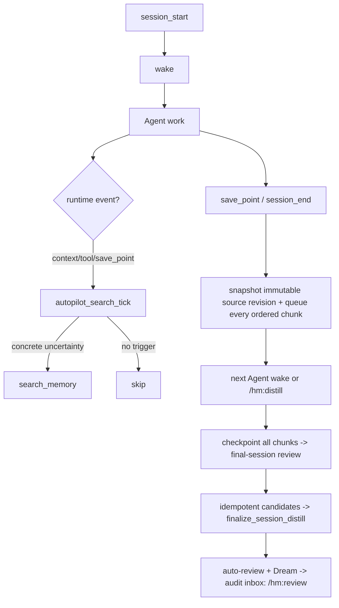

# Autopilot Search Policy

`wake -> search -> distill -> review -> dream` is the software loop inside
`harness-mem`, not a daily manual checklist for the user. The runtime entry for
task-aware search is the MCP tool `autopilot_search_tick`.



The product principle is the same shape as Constitutional AI: the human moves
from reviewing every item to defining and auditing the principles. The runtime
and Agent client apply those principles automatically, keep provenance, and let
the user inspect or undo outcomes later.

## Loop Contract

```text
session_start -> wake
context/tool/save_point -> task-aware search
save_point/session_end -> snapshot an immutable source revision + queue all chunks
next Agent-capable wake or /hm:distill -> checkpoint chunks + final review + idempotent candidates
finalize_session_distill -> completeness check + auto-review + Dream
review -> post-hoc audit, correction, undo, supersede
dream -> maintenance ledger and reversible cleanup
```

`/hm:*` commands remain useful, but they are control and fallback surfaces.
When a client has hooks or an Agent extension API, the default installation
should register the automatic path for that client.

## Client Event Model

Different clients expose different hook names. `harness-mem` should target a
small event model and let installers map it to Claude Code, Cursor, Codex, Pi,
Gemini CLI, or other clients.

| Event | Purpose | Typical mapped hook |
|---|---|---|
| `session_start` | Resolve the workspace project and inject `wake` context. | SessionStart, before-agent-start, first context transform. |
| `context_transform` | Add bounded memory context before an LLM request. | Pi `transformContext`, provider-payload/context hook. |
| `tool_result` | Learn from file/search/test/build outcomes and decide whether extra memory search is useful. | PostToolUse, Pi `afterToolCall`, tool-result observer. |
| `save_point` | Snapshot the settled native transcript as an immutable source revision and queue its complete ordered chunks. | turn end, message end, after-agent, save point. |
| `session_end` | Flush the current source revision and preserve every queued chunk for the next Agent-capable invocation; it does not summarize. | Stop, SessionEnd, SubagentStop, idle/settled hook. |

The installer should configure every supported event the client exposes. If a
platform lacks hooks, `/hm:wake`, `/hm:search`, `/hm:distill`, `/hm:review`,
and `/hm:dream` are the fallback.

## Runtime Scheduler Contract

`autopilot_search_tick` receives one normalized event payload and returns:

- `decision`: whether search should run, the trigger, bounded query, and skip
  reason when search is not warranted.
- `search`: the normal `search_memory` payload when search runs.
- `context_injection`: source ids, `answer_ready_context`, `context_plan`,
  supporting evidence, drilldown hints, and a suggested
  `record_context_outcome` call for later feedback.

The tool maps agent scheduling events rather than IDE names:

| Agent scheduling point | Native examples | `autopilot_search_tick` use |
|---|---|---|
| Before provider request | Pi `transformContext`, extension `context`, provider payload hook | Search only if the task text contains explicit recall, convention uncertainty, conflict, or long-horizon switch. |
| Before a tool call | Pi `beforeToolCall`, Claude Code `PreToolUse` | Search only for convention/boundary uncertainty before a risky action. |
| After a tool result | Pi `afterToolCall`, Claude Code `PostToolUse`, `PostToolUseFailure` | Search on errors, flaky outcomes, conflicts, or evidence that contradicts known truth. |
| Save point / next turn | Pi `prepareNextTurn`, turn-end/after-agent | Snapshot the current source revision and queue all ordered chunks. The next Agent-capable wake resumes from durable chunk checkpoints, then refreshes context. |

Session-start stays `wake`. Session-end captures an immutable native transcript
revision and queues its complete ordered chunk set; it never claims semantic
summarization completed. An Agent-capable wake or `/hm:distill` resumes the
checkpointed distill pipeline. That separation keeps hook work small and the
task-aware search policy testable inside `harness-mem`.

## Search Is Not Always-On

Always injecting search results wastes context and can make stale memory look
more authoritative than the repo. Search should run when the Agent has a
specific retrieval need. In runtime this means `autopilot_search_tick` must
name the trigger before it is allowed to call `search_memory`.

Default triggers:

| Trigger | Query shape | Why it is worth searching |
|---|---|---|
| Explicit recall request | User words plus project name. | The user asked for prior context. |
| Project convention uncertainty | Current task, files, and terms like "convention", "rule", "boundary". | Prevents violating durable repo norms. |
| Conflict or contradiction | Claimed fact plus conflicting current observation. | Finds supersede history or prior decisions. |
| Tool failure or flaky result | Tool name, error summary, failing file/test. | Recovers prior fixes and known environment issues. |
| Pre-write durable claim | Candidate memory text plus evidence ids. | Grounds distill before auto-promotion. |
| Long-horizon task switch | New module, branch, feature, release boundary. | Refreshes only the relevant slice, not the whole memory set. |

Do not search just because another turn started, a file was read, or a tool
returned any output. The search trigger should name the uncertainty it is
trying to resolve.

## Trigger Decision

The Agent/client should make a small policy decision before calling
`search_memory`:

```text
1. What am I uncertain about?
2. Can current repo/tool evidence answer it cheaply?
3. Is the uncertainty likely to have durable project history?
4. What bounded query would retrieve only that history?
5. What budget should the result use in the next context?
```

If the answer to step 3 is no, do not call memory search. If current repo facts
and memory disagree, current repo/tool evidence wins unless memory points to a
specific historical decision that still applies.

## Read Path

Search should prefer the current project and current trust tiers:

- `user_confirmed` and `auto_confirmed` are normal full-weight memory.
- `provisional` can be included only when the caller accepts caveated context.
- `pending`, `deferred`, and `rejected` are not normal read-path memory.
- `superseded` appears only for history or conflict analysis.

Every injected result should keep source ids and a short reason for why it was
added. This lets `record_context_outcome` and later dream maintenance learn
whether the context helped, was ignored, or misled the Agent.

## Write Path

At save points or session end, the hook/runtime path only:

1. Capture the native transcript as a project-scoped, immutable source revision.
2. Split that complete revision into ordered chunks without truncating any
   character, turn, tool call, or final response.
3. Queue every chunk durably for the next Agent-capable invocation.

Observations remain derived search aids. They are not the authoritative
transcript source and cannot replace the immutable source revision.

When that Agent invocation occurs, or when `/hm:distill` is explicitly used,
the pipeline continues:

1. Claim each offered job by passing its `distill_job_id` to
   `prepare_session_distill`, preserving bounded selection, full text, and
   source-revision order.
2. Process and checkpoint each chunk so interruption resumes after the last
   completed chunk without duplicate writes.
3. After every expected chunk is checkpointed and the source revision is still
   current, run the required final-session semantic review.
4. Run risk-scaled admission and write admitted or narrowed claims as
   idempotent candidates.
5. Call `finalize_session_distill`; it verifies completeness, runs candidate
   auto-review, completes the distill job, and runs Dream.

Low-risk candidates may become `auto_confirmed`. Risk-flagged but useful
candidates may become `provisional`. Weak, conflicting, or dangerous items stay
out of the normal read path until audit.

## Review Is Audit

`/hm:review` is where users inspect the ledger and correct the system:

- confirm useful auto-promoted or provisional items as `user_confirmed`
- reject or undo bad auto-promotions
- supersede stale truth with visible lineage
- inspect why a memory appeared in `wake` or `search`

The user should not have to approve every low-risk memory before future Agents
can benefit from it.

## Design Sources

This policy is informed by:

- Pi `AgentHarness` event design: context transforms, tool-call hooks, tool
  result hooks, save points, and turn snapshots.
- Constitutional AI's oversight pattern: humans write/audit principles while
  AI applies them at scale.
- `harness-mem` 0.8.8 governance statuses and state-event audit log.
