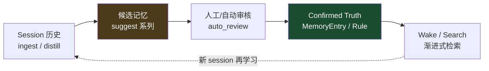
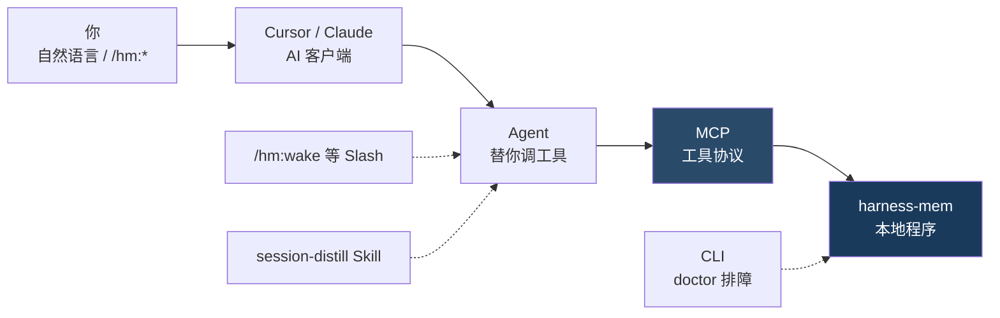
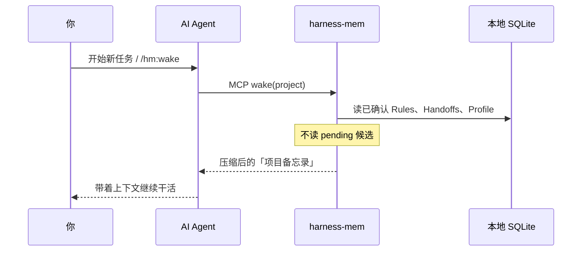
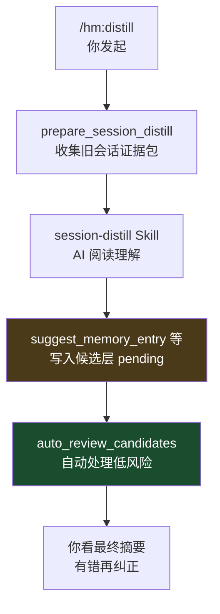
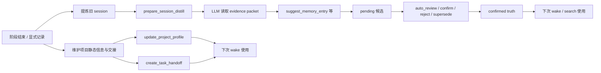
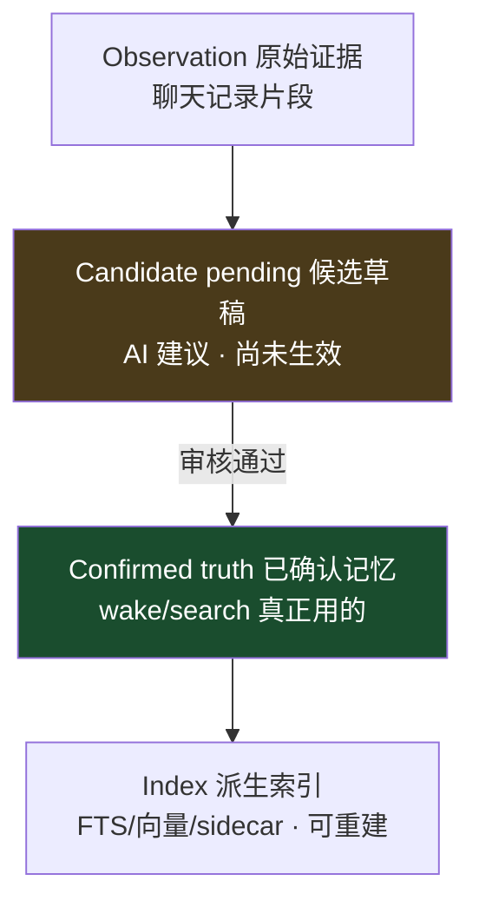
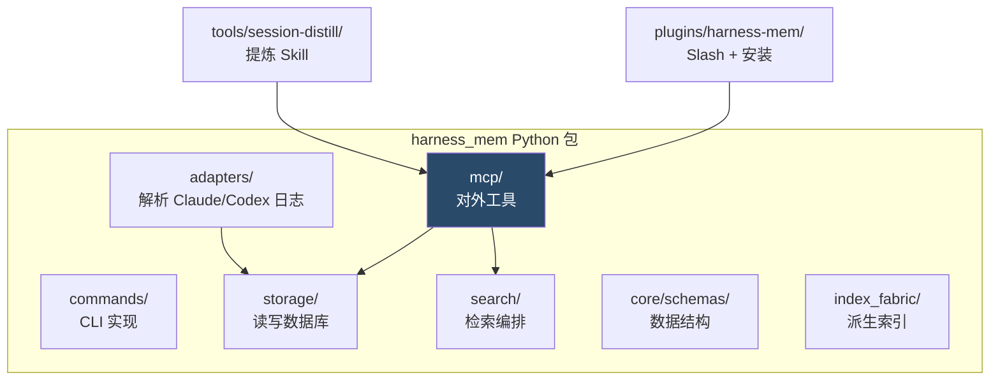
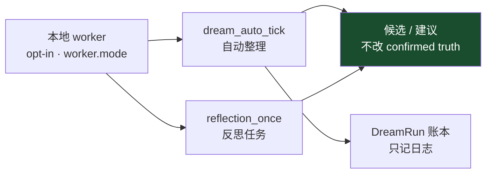
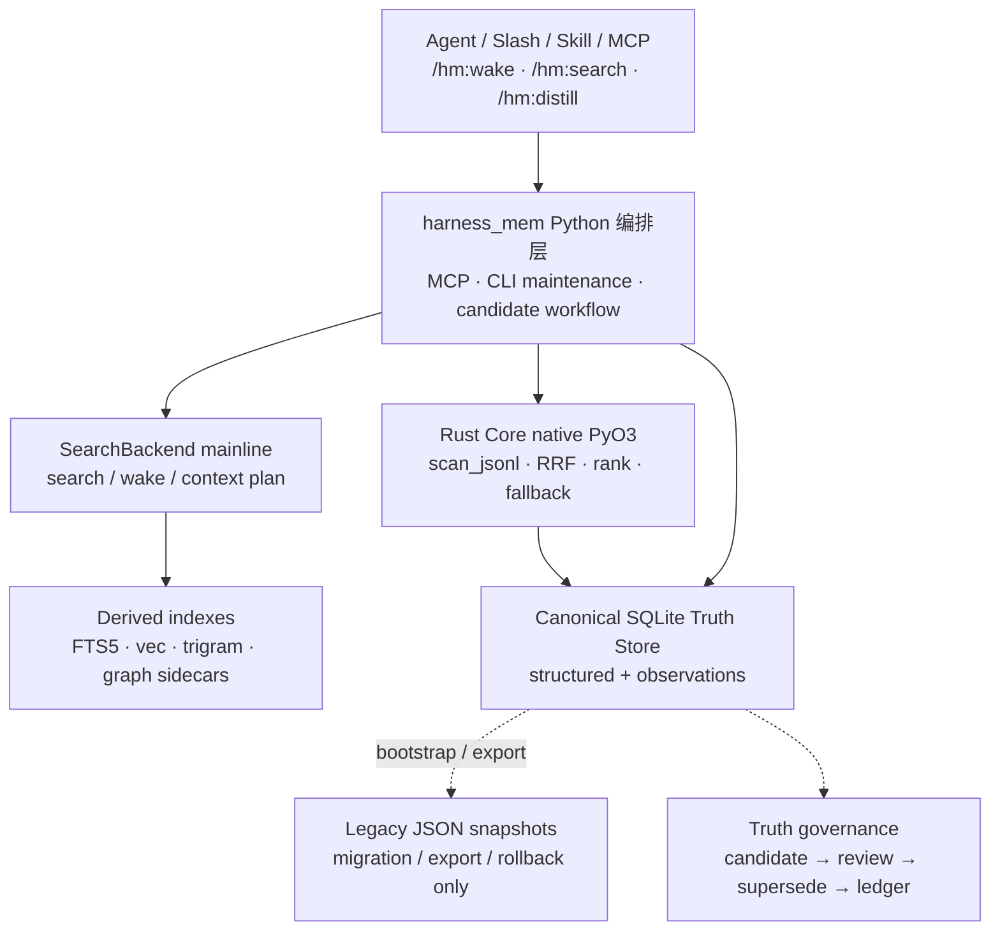
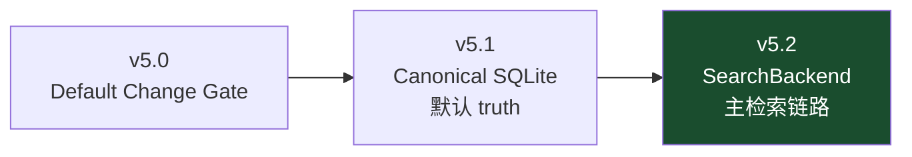

# harness-mem 运行图解（入门）

> 面向不熟悉内部名词的读者。用流程图说明「项目怎么跑」、数据怎么分层、代码模块怎么分工。
>
> 当前版本以 [`roadmap-status.md`](./roadmap-status.md) 为准（核对：2026-06-18，v5.8.0）。
> 更细的 MCP 工具表见 [`best-practices.md`](./best-practices.md)；Agent 协作真值见根目录 [`AGENTS.md`](../AGENTS.md)。

## 一句话

**harness-mem = 本地「AI 记忆管家」**：把聊天记录变成可审核的长期记忆，下次开新对话时自动告诉 AI「这个项目已经定了什么」。

核心规则：**所有写入先走候选（pending），不能静默改掉已确认事实（confirmed truth）**。

---

## 三条日常路径

| 场景 | 你怎么做 | 背后发生什么 |
|------|----------|--------------|
| 开始干活 | `/hm:wake` 或「唤醒 harness-mem 项目」 | AI 拿到 Rules、Handoffs、Profile 摘要 |
| 查历史决策 | `/hm:search "…"` | 先短摘要命中，不够再 timeline / 原文 |
| 阶段结束整理 | `/hm:distill` | 提炼旧会话 → 写候选 → 自动审核 → 你看摘要纠错 |

---

## 图 0：记忆生命周期闭环

虚线含义：新 session 再次 ingest，持续学习，**仍走候选门控**。

---

## 图 1：你每天怎么碰到它（入口地图）

| 名词 | 白话 |
|------|------|
| **MCP** | 让 Cursor/Claude 能调用本地程序的协议层 |
| **Slash** | 聊天里输入 `/hm:wake` 这类斜杠命令 |
| **Agent** | 替你读文件、跑工具的 AI |
| **Skill** | 给 AI 的操作手册（如 `tools/session-distill/`） |
| **CLI** | 终端命令；**日常不用**，安装、自检、排障时用 |

你不需要记全部 MCP 工具名；说「用 harness-mem 唤醒项目」即可。维护者连接 MCP 时约有 **60** 个工具注册；v5.8 起可选用 `minimal` profile，日常列表约 **28** 个（见下文）。

---

## MCP 日常主入口（给 Agent / 维护者）

> **v5.8 已发布**：默认仍为 `full` profile；`minimal` 只缩短 `tools/list`，不删能力。
> 清单来源：gstack 审阅 [`maintainer-feature-surface-trim.md`](./maintainer-feature-surface-trim.md)。

### 主入口 8（用户叙事 — 不是 8 个工具）

多数会话只需关心下面 **8 类** 能力（每类可能对应多个 MCP 工具）：

| # | 你 / Agent 想做什么 | 典型 MCP（类） |
|---|---------------------|----------------|
| 1 | 看项目记忆健康与下一步 | `get_project_status` |
| 2 | 按问题搜记忆 | `search_memory` |
| 3 | 开任务前注入上下文 | `wake` |
| 4 | 阶段结束整理会话 | `prepare_session_distill` |
| 5 | 看待审核项 | `list_candidates` |
| 6 | 自动过一遍低风险候选 | `auto_review_candidates` |
| 7 | 提议新记忆/规则/关系 | `suggest_*`（memory / rule / relation / supersede / correction） |
| 8 | 确认或拒绝候选 | `confirm_*` / `reject_*`（与 suggest 成对） |

### 何时用 full profile

| 场景 | 说明 |
|------|------|
| 每周 opt-in 维护 | `/hm:dream` 或 full 下的 `dream_*` / `metabolism_*`（**minimal 不含**） |
| Skill 治理 / 晋升 | `detect_skill_*`、`suggest_skill` 等 |
| 发版 / 成本诊断 | `benchmark_matrix_report`、`surface_cost_report` |
| 原文 regex 搜 | `search_raw` |
| 图实验召回 | `trace_relations`（时序问题优先 `temporal_query`） |

### minimal 与 full 对比

| | minimal | full |
|---|---------|------|
| `tools/list` 约 | **28** | **60** |
| 默认 | 否（保持 **full**） | **是** |
| 调 hidden 工具 | 结构化错误 | 正常 |

---

## 图 2：新对话开始 — Wake（唤醒）

| 名词 | 白话 |
|------|------|
| **Wake** | 给 AI 一份「这个项目目前已知什么」的精简摘要 |
| **Rule** | 长期约定，如「禁止用某库」「测试必须跑 pytest」 |
| **Handoff** | 任务交接单：做到哪、下一步、卡在哪 |
| **Profile** | 项目画像：技术栈、关键文件、目录约定 |
| **pending 候选** | AI 建议记住但**还没生效**的草稿；wake **不会**用它们 |

---

## 图 3：阶段结束 — Distill（提炼）

| 名词 | 白话 |
|------|------|
| **Distill** | 从旧会话里挖出值得长期记住的决策 |
| **Observation** | 原始聊天片段，作为证据 |
| **suggest_*** | 「我建议记住这条」的写入接口，先进候选 |
| **auto_review** | 自动确认明显靠谱的低风险项、拒绝噪声 |
| **confirm / reject** | 人工或策略把候选变成正式记忆或丢掉 |

v2.0 后没有正则启发式提炼；必须由 LLM 理解后再 `suggest_*`。

## 图 3A：阶段结束后的两类写入（简化视图）

这张图只强调**分叉关系**：

- `distill` 负责把旧 session 提炼成候选，再进入审核链。
- `update_project_profile` 和 `create_task_handoff` 是并行维护路径，不属于 `suggest_*` 候选链。
- `confirmed truth` 主要进入后续 `wake / search`；`profile / handoff` 直接提升下一次 `wake` 的上下文质量。

---

## 图 4：查历史 — Search 渐进式披露

| 名词 | 白话 |
|------|------|
| **FTS5** | SQLite 全文关键词搜索，搜类名、函数名很准 |
| **Hybrid** | 关键词 + 语义向量混合，适合模糊问题 |
| **Embedding** | 把句子变成向量，用于语义相似度 |

检索模式：`fts` 偏符号名；`hybrid` 偏意图/概念（需 `harness-mem[hybrid]` 依赖）。

---

## 图 5：数据分层（从原始到可用）

| 名词 | 白话 |
|------|------|
| **MemoryEntry** | 一条结构化事实 |
| **Supersede** | 用新事实取代旧事实，保留变更链 |
| **Canonical store** | v4 主存储形态（SQLite 为中心） |
| **Index Fabric** | 加速检索的派生索引，删了也能重建 |

**Truth governance**：confirmed truth 变更必须走 candidate → review → supersede → ledger。

---

## 图 6：代码模块地图

| 路径 | 作用 |
|------|------|
| `harness_mem/mcp/` | MCP 工具定义：`wake`、`search_memory`、`suggest_*` 等 |
| `harness_mem/storage/` | SQLite 读写、候选层、confirmed truth |
| `harness_mem/search/` | FTS + hybrid 检索编排 |
| `harness_mem/adapters/` | 解析 Claude Code / Codex 会话归档 |
| `tools/session-distill/` | 长程提炼 Skill（参考实现） |
| `plugins/harness-mem/` | `/hm:*` Slash、安装脚本、IDE 集成 |
| `crates/harness_mem_core_rs/` | v5.x native Rust 热路径（PyO3） |

`rust_core.py` 优先走 native `harness_mem_core_rs`；不可用时 Python fallback。

---

## 图 7：后台自动维护（Auto Dream）

| 名词 | 白话 |
|------|------|
| **Auto Dream** | 后台帮你整理记忆，像「自动归档」 |
| **DreamRun** | 每次自动维护的运行记录，`/hm:dream` 可查看 |
| **Reflection queue** | 反思任务队列，按 job 生命周期跑 |

v5.2：`host` 触发默认 **off**；`worker.mode=on` 可开启本地 worker；`dream.auto.enabled` 控制 Auto Dream。

---

## 图 8：v5.2 运行时架构分层

---

## 图 9：v5.1 / v5.2 Default Kernel Cutover

v5.2 含义：**默认内核已切换**。v5.1 把 canonical SQLite 设为默认 truth store，
v5.2 把 MCP `search_memory` / `wake` 的 query-driven 路径、task-aware context plan
和 `context_assembly` L3/L4 统一到 `SearchBackend` 主链路。

边界不变：仍不能说全局 token/cost saving、Storage v2 公开 speedup；也**没有**
借这次切换顺手引入 Tantivy/LanceDB/ANN、`deep_memory_search` 或 outcome-aware decay。

---

## 名词速查表

### 入口与日常操作

| 名词 | 白话 | 在哪遇到 |
|------|------|----------|
| Wake | 新对话开始时的「项目备忘录」 | `/hm:wake` · MCP `wake` |
| Search | 按问题查找历史决策/事实 | `/hm:search` · `search_memory` |
| Distill | 从旧会话提炼长期知识 | `/hm:distill` |
| MCP | AI 客户端调本地工具的标准协议 | Cursor MCP 配置 |
| Slash | `/hm:xxx` 快捷命令 | 插件 `plugins/harness-mem/` |
| Skill | AI 操作说明书 | `tools/session-distill/` |
| CLI | 终端；装/修/维护用 | `harness-mem doctor` |

### 记忆与数据

| 名词 | 白话 | 在哪遇到 |
|------|------|----------|
| Observation | 原始聊天片段 | `timeline` · `get_observations` |
| Candidate / pending | 待审核草稿 | `list_candidates` |
| Confirmed truth | 审核通过、可被 wake/search 使用 | MemoryEntry · Rule |
| MemoryEntry | 一条结构化事实 | `suggest_memory_entry` |
| Rule | 长期遵守的约定 | `suggest_rule` · `confirm_rule` |
| Handoff | 任务交接 | `create_task_handoff` |
| Supersede | 新事实取代旧事实 | `confirm_supersede` |
| Project Profile | 项目静态画像 | `update_project_profile` |

### 检索与存储

| 名词 | 白话 | 在哪遇到 |
|------|------|----------|
| FTS5 | 关键词全文搜索 | 搜类名、函数名 |
| Hybrid | 关键词 + 语义向量 | `pip install harness-mem[hybrid]` |
| Embedding | 文字转向量 | 默认 `all-MiniLM-L6-v2` |
| SQLite | 本地主数据库 | `~/.harness-mem/` 等 |
| Index Fabric | 可重建派生索引 | v4 index sidecar |
| Canonical store | v4 DB-first 主存储 | migration dry-run/apply |
| Rust Core | native PyO3 热路径 | `crates/harness_mem_core_rs/` |

### 维护与自动化

| 名词 | 白话 | 在哪遇到 |
|------|------|----------|
| auto_review | 自动处理低风险候选 | distill 同一轮 |
| Auto Dream | 后台自动整理 | `/hm:dream` |
| DreamRun | 自动维护运行记录 | `dream_ledger` MCP |
| Reflection queue | 反思任务队列 | `reflection_once` |
| Doctor | 健康自检 | `harness-mem doctor` |
| `/hm:mark` | 标记蒸馏资产 | 维护 Slash |
| `/hm:prune` | 修剪冗余 | 维护 Slash |

---

## 相关文档

| 文档 | 用途 |
|------|------|
| [`README.md`](../README.md) | 安装与 Golden Path |
| [`best-practices.md`](./best-practices.md) | 日常使用与 MCP 工具场景 |
| [`roadmap-status.md`](./roadmap-status.md) | 当前版本与完成度 |
| [`AGENTS.md`](../AGENTS.md) | AI 协作真值 |
| [`diagrams/`](./diagrams/) | 正式 SVG 架构图（维护者） |

---

## 渲染说明

本文使用 [Mermaid](https://mermaid.js.org/) 流程图。在以下环境中可直接渲染：

- GitHub / GitLab Markdown 预览
- VS Code / Cursor（安装 Mermaid 预览扩展）
- 支持 Mermaid 的文档站点

若预览器不支持 Mermaid，可将各代码块复制到 [Mermaid Live Editor](https://mermaid.live/) 查看。

## 配套 Canvas（交互面板）

仓库根目录 `canvases/` 保存 Cursor Canvas 源码，可在 IDE 中打开后与聊天并排查看：

| 文件 | 用途 |
|------|------|
| [`../canvases/harness-mem-how-it-works.canvas.tsx`](../canvases/harness-mem-how-it-works.canvas.tsx) | 入门图解：7 张流程图 + 名词白话表 |
| [`../canvases/harness-mem-completion.canvas.tsx`](../canvases/harness-mem-completion.canvas.tsx) | 完成度评估：五维完成度、v5.8 运行时与体验线、能力矩阵 |
| [`maintainer-feature-surface-trim.md`](./maintainer-feature-surface-trim.md) | Maintainer：MCP 暴露面精简审阅（gstack） |
| [`reference-comparison-matrix.md`](./reference-comparison-matrix.md) | Maintainer：十维参考项目对比矩阵（非用户向） |

> Canvas 需在 Cursor 中打开 `.canvas.tsx` 文件渲染。若侧边未自动弹出，从文件树点开即可。
