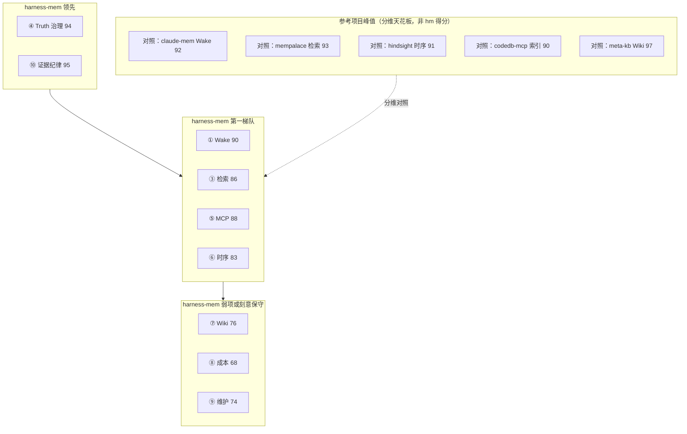

# 参考项目十维对比矩阵（Maintainer）

> **Maintainer working note — subjective matrix.**
>
> 核对日期：2026-06-18 · harness-mem **v5.6.0**（v5.3-v5.6 已加入 DX / maintenance / outcome-loop / field-test artifacts，评分仍按 artifact-backed 保守口径）
>
> 本文是**能力雷达**，不是跨项目「总分榜」；若用于对外材料，应先转化为有本仓 artifact 支撑的具体 claim。
> 参考边界与「该借什么 / 不该借什么」仍以 [`reference-projects.md`](./reference-projects.md) 为准；
> 当前版本真值以 [`roadmap-status.md`](./roadmap-status.md) 与 `CHANGELOG.md` 为准。

## 文档定位

| 是什么 | 不是什么 |
|--------|----------|
| 分维度对照：harness-mem vs 参考项目在各能力轴上的相对位置 | 单一 KPI 或「谁赢谁输」总冠军 |
| 基于参考源码深读 + harness-mem 代码 / benchmark artifact 的主观分（0–100） | 把 codedb-mcp / mempalace 的外部 benchmark 写成 harness-mem 分数 |
| 帮助 maintainer 判断差距、吸收优先级、对外 claim 边界 | 用户上手文档（用户请看 [`how-it-works-visual-guide.md`](./how-it-works-visual-guide.md)） |

**参考项目源码镜像**（maintainer 本地，不在 harness-mem 主仓内）：

```text
../upstreams/harness-mem/     # 相对 AIInfra 布局：F:\AIInfra\upstreams\harness-mem\
  claude-mem/
  codedb-mcp/
  mempalace/
  ai-harness/
  hindsight/
  hypatia/
  llm_wiki/
  meta-kb/
  evo/
  OpenSpace/
  Memento-Skills/
  MemChinesePalace/
  EverOS/
  …
```

---

## 十维定义

| # | 维度 | 评什么 |
|---|------|--------|
| 1 | **渐进披露 / Wake** | 分层注入、search → timeline → detail、token 预算 |
| 2 | **存储与索引** | truth store、sidecar、迁移、规模与可重建性 |
| 3 | **检索质量** | FTS / vector / hybrid、可复现 recall 证据 |
| 4 | **Truth 治理** | 候选 → 审核 → supersede → ledger；禁止静默改 truth |
| 5 | **MCP / 多客户端** | 工具面宽度、IDE hook、跨客户端一致性 |
| 6 | **时序 / 双时态** | as_of、valid/recorded time、supersede 链 |
| 7 | **生成知识 / Wiki** | claims、source map、citation、incremental compile |
| 8 | **成本 / Token 可观测** | 每 surface 计量、预算、可对外 claim 边界 |
| 9 | **后台维护** | dream / sleep / 代谢、ledger、opt-in 纪律 |
| 10 | **证据 / Benchmark** | artifact gate、claim readiness、不发未验证宣称 |

**读分规则：**

- **0–100** 为 maintainer 主观分，每项应有代码或 artifact 依据（见下文「harness-mem 分项依据」）。
- 不同项目**品类不同**（code-intel、wiki 编译器、实验编排器、memory runtime），全表对比是雷达，不是公平赛跑。
- **均分**仅供粗览；决策时看单维与品类，不看均分排名。

---

## 「参考项目峰值」是什么意思？

**参考项目峰值** = 在**某一维**上，所有参考项目里**最高的分**（该维度的「天花板」）。

用途：

- 看 harness-mem 离「这一维最强参考」还差多少，或是否已并列/领先。
- **不是** harness-mem 自己的成绩，也**不是**「参考项目总分」。

示例：

| 维度 | harness-mem | 参考项目峰值 | 读法 |
|------|------------:|-------------:|------|
| ① Wake | 90 | claude-mem **92** | 披露略逊峰值 2 分 |
| ③ 检索 | 86 | mempalace **93** | 检索 recall 仍低于 mempalace 自报 |
| ④ Truth | **94** | （无更高） | hm 在该维为参考中最强档 |
| ⑦ Wiki | 76 | meta-kb **97** | 刻意不做 wiki-as-truth，差距预期内 |
| ⑧ 成本 | 68 | OpenSpace **87** | 有观测；全局 saving claim 仍 blocked |

下图「参考项目峰值」节点即上表这类**分维天花板**标签，避免误读为 harness-mem 得分。

---

## 全维度评分总表

| 项目 | 定位 | ① | ② | ③ | ④ | ⑤ | ⑥ | ⑦ | ⑧ | ⑨ | ⑩ | **均分** |
|------|------|--:|--:|--:|--:|--:|--:|--:|--:|--:|--:|---------:|
| **harness-mem** v5.6 | 跨会话 memory runtime + truth gate | **90** | 87 | 86 | **94** | 88 | 83 | 76 | 68 | 74 | **95** | **84.1** |
| hindsight | 生产级 memory OS | 88 | **93** | **94** | 80 | **93** | **91** | 52 | 75 | 90 | 78 | 83.4 |
| mempalace | memory 引擎 | 88 | 90 | **93** | 74 | 90 | 84 | 76 | 52 | 78 | 94 | 81.9 |
| claude-mem | hook 压缩 + 渐进检索 | **92** | 86 | 78 | 20 | 90 | 32 | 52 | 72 | 38 | 48 | 60.8 |
| codedb-mcp | 本地 code-intel MCP | 74 | 90 | 86 | 58 | 72 | 38 | 70 | 64 | **84** | 76 | 71.2 |
| OpenSpace | 技能库 + 检索 + MCP | 80 | 84 | 86 | 72 | 88 | 66 | 74 | **87** | 79 | 83 | 79.9 |
| ai-harness | MemPalace 壳 + 团队 wiki | 78 | 82 | 86 | 70 | 86 | 68 | **91** | 45 | **93** | 72 | 77.1 |
| llm_wiki | 源码 → wiki 产品 | 72 | 86 | 89 | 70 | 80 | 20 | **96** | 32 | 58 | 72 | 67.5 |
| Memento-Skills | 会话记忆 + 巩固 | 74 | 70 | 60 | 64 | 58 | **81** | 71 | 79 | **83** | 74 | 72.4 |
| hypatia | 本地三元组 KG + JSE | 65 | 88 | 85 | 30 | 20 | 55 | 38 | 12 | 18 | 80 | 49.1 |
| meta-kb | claims-first 编译管线 | 42 | 76 | 28 | **94** | 12 | 50 | **97** | 38 | 62 | 68 | 56.7 |
| evo | 自动实验编排 | 58 | 48 | 32 | 76 | 82 | 42 | 38 | 52 | 55 | **92** | 59.7 |
| MemChinesePalace | 中文压缩展示 | ~70 | ~55 | ~50 | ~40 | ~30 | ~35 | ~65 | ~25 | ~30 | ~40 | ~44 |
| EverOS | Memory OS 平台壳 | ~75 | ~85 | ~80 | ~70 | ~85 | ~75 | ~60 | ~65 | ~80 | ~70 | ~76 |

带 `~` 的为快速扫仓估算，未逐文件深读。其余分数来自 `../upstreams/harness-mem/<project>/` 源码与 harness-mem 仓内 benchmark / 文档。

### 分维峰值速查

| 维 | 峰值项目 | 峰值分 | harness-mem | 差值 |
|----|----------|-------:|------------:|-----:|
| ① Wake | claude-mem | 92 | 90 | −2 |
| ② 存储 | hindsight | 93 | 87 | −6 |
| ③ 检索 | hindsight | 94 | 86 | −8 |
| ④ Truth | harness-mem / meta-kb* | 94 | 94 | 0 |
| ⑤ MCP | hindsight | 93 | 88 | −5 |
| ⑥ 时序 | hindsight | 91 | 83 | −8 |
| ⑦ Wiki | meta-kb | 97 | 76 | −21 |
| ⑧ 成本 | OpenSpace | 87 | 68 | −19 |
| ⑨ 维护 | ai-harness | 93 | 74 | −19 |
| ⑩ 证据 | harness-mem | 95 | 95 | 0 |

\* meta-kb 的 94 是**编译期 claims 验证**，不是 live memory runtime；与 harness-mem 同分但品类不同。

---

## harness-mem 十维分项依据（v5.6.0）

| 维 | 分 | 主要依据 | 相对结论 |
|----|---:|----------|----------|
| ① Wake | **90** | `wake`、`context_assembly`、task-aware `wake_packet`；v5.2 `SearchBackend` 主链路；v5.3 guidance metadata | 略逊 claude-mem hook 自动注入；强于无 runtime wake 的 meta-kb |
| ② 存储 | **87** | v5.1 canonical SQLite 默认 truth；Storage v2 10k/100k/1M accepted；`index_fabric` + `harness_mem_core_rs` | 索引广度不及 codedb-mcp；memory store 纪律强于 claude-mem 直写 obs |
| ③ 检索 | **86** | LongMemEval hybrid-real **R@5=0.953**（[`benchmark/v160-baseline.md`](./benchmark/v160-baseline.md)）；reranker/HyDE 默认关 | 低于 mempalace 自报 96.6%、hindsight TEMPR；有 drift suite + shootout |
| ④ Truth | **94** | `auto_review_candidates`、supersede、dream undo ledger；无静默改 confirmed truth | 参考项目中 live runtime 最强档 |
| ⑤ MCP | **88** | `harness_mem/mcp/server.py` 33+ 工具；Cursor/Claude/Codex hook + `/hm:*`；v5.6 field-test packet | 略逊 hindsight、claude-mem 安装面 |
| ⑥ 时序 | **83** | MCP `temporal_query`：current/history/as_of、valid/recorded、supersede 链 | 弱于 hindsight、mempalace KG；强于 claude-mem |
| ⑦ Wiki | **76** | `knowledge_cache`、wiki bridge、claim metadata、citation validation | 弱于 llm_wiki / meta-kb / ai-harness；**刻意边界** |
| ⑧ 成本 | **68** | `surface_cost_report`、v4.6 bounded fixture；**`token_cost_saving.ready=false`**（全局） | 有观测、无公开全局省钱宣称 |
| ⑨ 维护 | **74** | Auto Dream opt-in、`dream_ledger`、metabolism；v5.4 unified maintenance summary；host 默认 off | 弱于常驻 daemon 类参考；符合不默认后台自治 |
| ⑩ 证据 | **95** | 31 accepted runs、八维 `memory_eval_matrix`、`claim_promotion`、`default_change_decision_gate.ready=true` | 参考项目中最完整的 release evidence 链 |

v5.6 注记：v5.3-v5.6 已新增 daily-flow DX metadata、guided maintenance summary、`record_context_outcome`、opt-in outcome ranking metadata、`context_outcome_loop` loop harness 和 v5.6 field-test packet。这些提升作为 release gate / UX 实现记录；正式重算分数前，不把它们写成 answer-quality、token/cost 或生产 ranking claim。

**Memory runtime 六维加权**（①③④⑤⑥⑨，各 1/6）：约 **86** — 与 mempalace / hindsight 胶着；**胜在治理 + 证据，输在纯检索峰值与平台化体验**。

---

## 相对定位（Mermaid）

以下使用 `flowchart`（兼容 GitHub / Cursor 预览）。**勿用 `quadrantChart`**——多数预览器不支持。



---

## 按吸收线分组的胜负（简表）

### harness-mem 领先或并列

| 维度 | 说明 |
|------|------|
| ④ Truth 治理 | 候选 / 审核 / supersede / ledger 闭环；claude-mem、hypatia 等普遍弱 |
| ⑩ 证据纪律 | 28 collections + claim gate；evo 实验纪律强但不是 memory 证据链 |
| ⑥ 时序（工程克制） | SQLite 双时态 read model，不上图数据库重资产 |

### 中等偏上，有明确差距

| 维度 | 说明 |
|------|------|
| ① Wake / ③ 检索 | 已吸收 claude-mem + mempalace，但 LongMemEval 仍低于 mempalace 自报、hindsight |
| ⑤ MCP | 工具面够宽；安装 / 多 IDE 体验仍逊 claude-mem |

### 刻意不做或明显落后

| 维度 | 说明 |
|------|------|
| ⑦ Wiki 产品化 | llm_wiki、meta-kb、ai-harness 更强；hm 只做 bridge |
| ② 代码索引 | codedb-mcp 为 P0 参考，不是竞品分数 |
| ⑧ 全局 token 省钱宣称 | gate 故意 `ready=false` |
| ⑨ 常驻 daemon | Memento / ai-harness 更强；hm 坚持 opt-in |

---

## 与官方 benchmark 维度的关系

本文 **十维** 是 maintainer 能力雷达，与仓内 **官方评测维度** 并存、不互相替代：

| 名称 | 用途 | 文档 / 代码 |
|------|------|-------------|
| LongMemEval 六型 | 检索 recall 分桶 | [`benchmark/longmemeval-five-dimensions.md`](./benchmark/longmemeval-five-dimensions.md)、`harness_mem/tools/longmemeval.py` |
| Memory Eval **八维** | v4.2 release gate 行为契约 | `benchmark-suite/memory_eval_matrix/`、`harness_mem/benchmark_matrix.py` |
| 产品 **五维完成度** | 主观完成度（非检索分） | [`../canvases/harness-mem-completion.canvas.tsx`](../canvases/harness-mem-completion.canvas.tsx) |

---

## 硬边界（重申）

- **external benchmark numbers 不是 harness-mem 分数**（尤其 codedb-mcp token 表）
- **generated layer 不是 truth store**
- **code-intel substrate 不是 memory runtime**
- retrieval / cost / latency 的 public claim 只能来自本仓 **named artifact**
- 本文分数若进入 README、CHANGELOG 或对外宣传，需改写为单项、可溯源的 claim；不要原样搬运主观分

---

## 相关文档

| 文档 | 用途 |
|------|------|
| [`reference-projects.md`](./reference-projects.md) | 该借什么 / 不该借什么 |
| [`roadmap-status.md`](./roadmap-status.md) | 当前版本与 claim 边界 |
| [`how-it-works-visual-guide.md`](./how-it-works-visual-guide.md) | 用户向运行图解 |
| [`benchmark/v160-baseline.md`](./benchmark/v160-baseline.md) | LongMemEval R@5 锚点 |
| [`../benchmark-suite/BENCHMARKS.md`](../benchmark-suite/BENCHMARKS.md) | 28 collections 目录 |
| [`../canvases/harness-mem-completion.canvas.tsx`](../canvases/harness-mem-completion.canvas.tsx) | 五维完成度 Canvas |

---

## 维护说明

- 更新评分时：同步改「核对日期」、harness-mem 版本号，并在 commit message 中注明「subjective maintainer matrix」。
- 总表分数变化后：先按总表重算「分维峰值速查」，再调整加粗，避免手工峰值漂移。
- 参考项目版本漂移时：在表下注记 upstream 标签或 commit，不要假装是实时自动分数。
- 若需用户可见的「项目怎么跑」，只链到 `how-it-works-visual-guide.md`，不要链本文。
