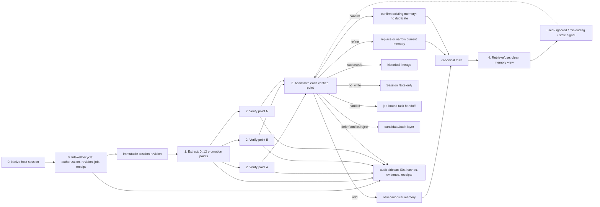

# 0.9.13-0.9.15 - Four-Stage Memory Quality Convergence

**Status:** 0.9.13 and 0.9.14 are implemented in the current worktree: the
contract/shadow baseline and the autonomous per-point assimilation path are
covered by deterministic and isolated runtime probes. 0.9.15 has started with
raw-source isolation: normal search and wake no longer return Observation
content unless deep recall is explicit. Clean response projection and governed
historical-data cutover have not started.

## Outcome

Make automatic session distillation produce the same kind of result a careful
project knowledge editor would produce: several independently verified,
atomic, deduplicated project memories when a session contains several durable
points, and no durable write when it contains only task-local narration.

The full product flow is:

```text
0. session intake and lifecycle
-> 1. extraction -> 2. verification -> 3. assimilation -> 4. retrieval/use
```

Stage 0 owns host intake, project authorization, immutable revisions/chunks,
job scheduling and terminal receipts, and source retention/cleanup. Its unit
is a session plus revision; it does not decide memory content. Stages 1--4 are
the four knowledge-adoption stages inside the full product lifecycle.

Extraction is already lossless, bounded, and multi-candidate. This iteration
does not replace native adapters, revision/chunk ingest, the coverage-first
manifest, semantic/raw drilldown, or the twelve-candidate ceiling. It fixes the
meaning of the later stages.

The four knowledge-adoption stages describe the lifecycle of knowledge inside a
distill operation. They do not replace Stage 0's native session lifecycle or the
five user/runtime actions:

```text
wake -> search -> distill -> review -> dream
```

Those five actions decide when memory is recalled, created, audited, or
maintained. `review` and `dream` form the feedback loop around assimilation and
retrieval; they are not a fifth linear stage. Stages 1--4 define how one distill
turns an authorized session revision into retrievable truth.

## Locked decisions

1. One session may produce zero, one, or many promotion points. Each point owns
   its own evidence, verification result, assimilation decision, and terminal
   disposition.
2. Session-level `promotion_decision` is an aggregate summary. It must not make
   every candidate succeed or fail together.
3. Source integrity is not durability. Proving that a user said something or
   that a file hash matches does not prove that the statement belongs in
   long-term memory.
4. Verification answers "is this claim supported now?" Assimilation answers
   "what should the project remember, if anything?"
5. Normal retrieval returns only canonical memory prose and useful freshness
   context. Session, job, candidate, evidence, hash, and policy identifiers are
   audit-only.
6. Ordinary verified low-risk knowledge may enter memory automatically. Human
   review is reserved for unresolved conflict, dangerous scope, and explicit
   product or architecture boundaries.
7. The canonical SQLite store remains the only truth store. A module-organized
   Markdown view may be derived for inspection; it is never a second authority.
8. The public MCP surface, native adapter formats, and existing source-retention
   safety boundary do not expand in this iteration.

## Why 0.9.12 is insufficient

The current pipeline already extracts up to twelve candidates and validates
content-addressed evidence. Its quality gap appears after extraction:

- `user_statement + verified` proves that the source exchange is authentic,
  but a one-off output request can still be treated as durable intent;
- a verified evidence envelope can auto-confirm a candidate before a separate
  semantic durability decision exists;
- rule `pattern` and `trigger` fields can both describe conditions, leaving no
  actionable behavior;
- `provisional` is stored in the truth layer even when the correct outcome is
  candidate-only or no durable write;
- in-pass normalized-text deduplication does not perform semantic
  confirm/refine/conflict/supersede against current project truth;
- audit-rich storage records can be mistaken for the user-facing memory
  product.

This delivery train therefore preserves extraction and inserts a first-class
assimilation contract between verification and truth mutation.

## Reference baseline

The content-quality reference reviewed for this iteration is the user-supplied
upstream conversation-distillation repository at commit
`92542f7337074fd28597440f2fde3c3279413428` (reviewed 2026-08-15).
Relevant evidence:

- `shared/references/distillation-rules.md` separates task-local Note content
  from stable reusable knowledge, requires current toolchain verification,
  groups final statements by project domain, and omits raw source IDs;
- `shared/references/deep-distill-workflow.md` distinguishes extraction,
  per-question verification, promotion, and batch check-work;
- the checked-in Antigravity `batch-7-report.md` demonstrates that an ANSWERED
  session may still be `Session Note only`, and that an already represented
  fact is confirmed without another knowledge entry;
- the supplied `servers` knowledge-base excerpt contains 60 module-organized
  project facts/procedures and no session/job/hash narration.

harness-mem adopts the final content discipline and per-point outcome model. It
does not adopt sequential first-N clipping, a Markdown truth store, mandatory
human approval for ordinary memory, or simple string similarity as the
canonical deduplication decision.

## Architecture



### Stage 0 - Session intake and lifecycle (existing foundation)

This stage is the source and execution boundary for all later stages. It owns
supported-host intake, project authorization, immutable revision/chunk
integrity, queue/lease/retry/idempotency behavior, job creation, Hook/provider
and terminal receipt binding, and policy-controlled source retention/cleanup.
Its unit is a session plus revision. It never treats a session or job as a
memory claim by itself.

### Stage 1 - Extraction (unchanged)

Inputs and behavior remain authoritative:

- immutable source revision and complete ordered chunks;
- coverage-first exchange manifest plus semantic/raw drilldown;
- final-session review over the complete source;
- zero to twelve atomic candidate signals per session;
- idempotent candidate identity bound to source revision;
- a readable session summary independent of memory promotion.

Required invariant: extraction maximizes bounded recall. It does not decide that
every detected signal is durable truth.

### Stage 2 - Per-point verification

Every extracted point receives an independent verification record:

```text
candidate_id
claim
evidence_basis
verification_refs
answer_status = ANSWERED | PARTIAL | UNANSWERED | CONTRADICTED | STALE |
                NOT_APPLICABLE
verified_at
```

Rules:

- repository claims require current project-relative content evidence;
- explicit user statements require an authentic user-role source exchange;
- transcript occurrence alone cannot verify repository truth;
- verification remains independent across promotion points;
- an unrelated unfinished task does not suppress an independently ANSWERED
  point; the session aggregate becomes `partial` and the unfinished item becomes
  a handoff;
- `ANSWERED` means eligible for assimilation, never automatic proof that the
  content should be remembered.

Verification itself has two checks that remain visible in audit evidence:

1. reference integrity: the cited exchange/file/chunk exists, has the expected
   role and scope, and still matches its content digest;
2. semantic support: the cited source actually supports the candidate wording,
   rather than merely containing nearby words.

Long-term utility is deliberately not a third verification outcome. It belongs
to assimilation. `NOT_APPLICABLE` always blocks durable admission; a valid user
preference uses authentic user-statement evidence and proceeds as `ANSWERED`,
not as a special promotable interpretation of `NOT_APPLICABLE`.

### Stage 3 - Assimilation

Assimilation transforms a verified point into one terminal decision:

| Disposition | Meaning | Durable mutation |
|---|---|---|
| `add` | New stable project knowledge | Insert one canonical truth |
| `refine` | Existing truth is related but incomplete or overbroad | Write replacement and supersede old truth atomically |
| `confirm` | Equivalent current truth already exists | No duplicate; append confirmation/audit evidence |
| `supersede` | A newer verified conclusion replaces old truth | Close old validity and write/link replacement |
| `no_write` | Valid session content that is one-off, narrative, duplicated instruction, or otherwise non-durable | Session Note/audit only |
| `handoff` | Concrete unfinished state required for resumption | Job-bound handoff only |
| `defer` | Durable value is plausible but proof or scope is incomplete | Candidate layer; not readable truth |
| `conflict` | Current evidence and current truth cannot be reconciled safely | Candidate/audit layer; no automatic truth mutation |
| `reject` | Unsupported, contradicted, unsafe, or malformed candidate | Terminal candidate/audit outcome; no truth mutation |

The assimilation decision carries:

```text
candidate_id
disposition
destination
canonical_title
canonical_statement
scope
topic_path
matched_truth_ids
durability_reason
```

Quality requirements:

- one canonical statement contains one durable fact or one actionable rule;
- rewrite session narration into future-useful project language;
- a rule must contain both its application condition and its required behavior;
- one-off output requests, task status, explanation requests, counts, and audit
  navigation are `no_write` unless the user explicitly establishes a durable
  future preference;
- code behavior that belongs in docs/tests is routed there instead of being
  generalized into Agent behavior rules;
- semantic matching runs against current truth before any insert;
- all durable mutations are project-scoped, content-addressed, atomic, and
  undoable through existing governance lineage.

Assimilation uses this decision order:

1. map non-ANSWERED evidence: `PARTIAL/UNANSWERED` to defer, handoff, or
   no-write; `NOT_APPLICABLE` to no-write; `CONTRADICTED/STALE` to reject plus
   explicit conflict/stale maintenance when current truth is affected;
2. route an ANSWERED point to handoff, repository docs/tests, or no-write before
   considering truth;
3. require durable future utility, atomic canonical wording, project scope, and
   a functional `topic_path`;
4. compare with current truth in this precedence:
   - an explicit verified temporal replacement -> `supersede`;
   - incompatible current claims without a proven replacement order ->
     `conflict`;
   - semantically equivalent current truth -> `confirm`;
   - a compatible, more precise or complete formulation -> `refine`;
   - no meaningful match -> `add`.

`refine` is compatible improvement; `supersede` is a temporal replacement.
Neither may leave both old and new rows current.

New autonomous distill writes must not use `provisional` as a catch-all truth
tier. A point either passes assimilation into `auto_confirmed` truth or remains
outside normal truth as `deferred`, `rejected`, `no_write`, or `conflict`.
Existing provisional rows remain readable only through the existing explicit
opt-in. Slice 4 migrates exactly the scoped 122 archive-derived rows, including
their provisional and auto-confirmed members. Other legacy provisional rows are
not silently reclassified in 0.9.13. The compatibility enum remains readable
for old data, but the new autonomous distill path does not create it.

### Stage 4 - Retrieval and use

Normal wake/search results project canonical knowledge into:

```text
title
statement
scope/freshness only when needed to interpret the statement
```

Default results exclude:

- session, source, job, candidate, memory, and evidence identifiers;
- hashes, locators, reason codes, provider receipts, and token accounting;
- rejected, deferred, provisional, and superseded content;
- several equivalent phrasings of the same current fact.

This is a candidate-source boundary, not just rendering cleanup:

- default `search_memory`, wake, and cross-project memory search generate
  candidates from current canonical truth only;
- raw/verbatim observations remain available through existing explicit raw,
  timeline, observation, and audit paths;
- a raw Observation never competes with canonical memory in the same default
  top-k result set;
- changing the default source mix requires compatibility tests for every host
  command that currently projects Observation previews.

Explicit audit detail may join the canonical row to its evidence and lifecycle
records. It must not change ranking or create another truth source.

## Multi-point session example

A session that changes an authentication flow may produce six points:

| Point | Verification | Assimilation | Result |
|---|---|---|---|
| Login endpoint replacement | ANSWERED | add | One new API memory |
| Persona sync trigger | ANSWERED | add | One new workflow memory |
| Deferred sync queue | ANSWERED | refine | Replace a broader existing memory |
| Response field already known | ANSWERED | confirm | No duplicate row |
| Temporary rollout command | ANSWERED | no_write | Session Note only |
| Remaining production rollout | PARTIAL | handoff | Job-bound handoff |

The aggregate session result is `partial`: three durable facts were absorbed,
one was confirmed without duplication, one stayed local, and one remains a
handoff. No session-wide boolean may erase those independent outcomes.

## Delivery slices

The slices ship as three independently releasable versions:

| Version | Slices | Production behavior |
|---|---|---|
| `0.9.13` | Implemented: Slice 0, read-only shadow classification, and migration rehearsal | No truth or default retrieval change |
| `0.9.14` | Implemented: Slices 1-2 plus deterministic/isolated outcomes | New autonomous distill uses per-point verification and assimilation; no new provisional truth |
| `0.9.15` | Planned: Slices 3-5 | Default canonical-only retrieval, governed cohort migration, native outcome, backlog restart |

README, Quickstart, plugin command text, generated descriptors, diagrams, and
release evidence change atomically with the version that actually changes the
corresponding runtime. The public release version remains unchanged until the
release workflow publishes these implemented slices.

### Slice 0 - Contract and golden corpus

Purpose: make quality measurable before changing runtime behavior.

Work:

- add the four-stage contract to roadmap, memory-adoption, distillation rules,
  governance, and test-plan documentation;
- version four new deterministic fixtures:
  - `F8-multi-promotion`: one session with add/refine/confirm/no-write/handoff;
  - `F9-request-vs-preference`: one-off output request beside an explicit durable
    future preference;
  - `F10-assimilation-conflict`: duplicate, narrower replacement, and genuine
    conflict against current truth;
  - `F11-clean-retrieval`: canonical prose plus audit metadata that must not
    leak into default retrieval;
- turn representative bad rows from the 122-entry archive batch into forbidden
  golden outputs;
- use the supplied module-organized upstream knowledge sample as a style and
  atomicity reference, not as runtime truth or a second store.

The executable baseline is
`harness_mem.qualification.assimilation_shadow`. It deliberately has no
provider, backend, or store dependency: reviewed fixture relationships produce
only proposed dispositions and `mutation_count = 0`. This proves the routing
and no-write boundaries before the 0.9.14 semantic absorber is allowed to make
any canonical mutation. It is not a substitute for that later semantic call.

Direct acceptance:

- every fixture names all expected promotion points and all forbidden writes;
- F8 proves more than one point from one session can independently terminate;
- the current bad rule about viewing audit/memory lists is `no_write`, unless an
  explicit durable preference is separately stated and normalized;
- no production data is mutated in this slice.

### Slice 1 - Separate verification from durability

Primary owners:

- `harness_mem/commands/evidence_admission.py`;
- `harness_mem/autonomous/provider.py` and strict response models;
- `harness_mem/autonomous/worker.py`;
- deterministic provider/evidence tests.

Work:

- preserve current evidence re-read and Answer Gate statuses;
- stop using `user_statement + verified` as sufficient durability admission;
- distinguish one-off request, explicit future preference, correction, project
  decision, repository fact, workflow, and task-local state;
- make session-level promotion status a derived aggregate of per-point results;
- keep each point's evidence and failure independent.

Direct acceptance:

- authentic one-off user requests verify their source but do not enter truth;
- explicit durable user preferences remain eligible;
- repository claims cannot pass through user-statement evidence;
- F8 partial state promotes the independent ANSWERED points and preserves the
  handoff;
- no extraction snapshot, manifest, drilldown, or adapter fixture changes.

### Slice 2 - Assimilation engine

Primary owners:

- a bounded internal assimilation module and schema;
- the existing isolated provider boundary with a separate assimilation receipt;
- `harness_mem/commands/auto_review.py`;
- `harness_mem/governance_status.py`;
- canonical structured-store mutation and lineage helpers;
- session Note and Answer Packet projection.

Work:

- implement
  `add/refine/confirm/supersede/no_write/handoff/defer/conflict/reject`;
- after at least one point becomes ANSWERED, use current search to select a
  bounded top-N set of same-project current truth and run one separate no-tools,
  strict-schema assimilation call over only the verified points and those
  candidate truths; do not resend the full transcript;
- let the assimilation model reference only opaque target handles supplied by
  the runtime; recheck every handle is same-project and still current before
  applying any decision;
- normalize candidates into `title + canonical_statement`;
- reject non-actionable rules whose condition and behavior are not both clear;
- perform semantic current-truth matching before inserts;
- use existing transactional store/event boundaries for replacement and undo;
- report every extracted point and terminal disposition in audit detail while
  showing only promoted statements in the normal Note.
- materialize an assimilated rule into the normal current rule read model;
  changing a RuleCandidate status alone is not a successful rule outcome;
- add optional `title` and `topic_path` payload fields with backward-compatible
  loading so module-organized views do not derive unstable titles from triggers.

Direct acceptance:

- F8 writes two new truths, replaces one, confirms one without duplication,
  writes no truth for one point, and creates one handoff;
- finalize replay produces the same truth IDs, lineage, and Note hash;
- a candidate cannot reach truth solely because confidence is `0.5` and its
  source hash is current;
- new autonomous distill creates no provisional truth.

Cost receipts report extraction and assimilation separately:

```text
extraction_provider_tokens/duration
assimilation_provider_tokens/duration
combined_provider_tokens/duration
```

### Slice 3 - Clean retrieval projection

Primary owners:

- `harness_mem/context_assembly.py`;
- `harness_mem/mcp/read_search_handlers.py`;
- `harness_mem/search/*` result projection and quality fixtures;
- wake/search documentation.

Work:

- return canonical title/statement by default;
- join audit metadata only for explicit audit detail;
- collapse equivalent current truth before final ranking;
- exclude candidate, provisional, rejected, and superseded rows by default;
- retain project, temporal, and source isolation;
- keep retrieval feedback bound to the canonical truth ID.
- update `/hm:search`, `/hm:search-all`, and wake projections so ordinary
  memory use does not silently reintroduce raw Observation candidates;
- align `/hm:review` with the actual candidate, conflict, auto-promoted, and
  historical correction states instead of documenting an inbox it does not
  query.

Direct acceptance:

- F11 default output contains zero internal identifiers, hashes, evidence reason
  codes, or storage kind names;
- explicit audit detail can recover the full provenance and verification trail;
- refine/supersede queries return only the current replacement;
- confirmation evidence does not create duplicate search hits.

### Slice 4 - Existing-memory convergence

Scope starts from the frozen 122-ID audit cohort, not from a live query that is
assumed to return 122 rows. A read-only 2026-08-15 preflight found:

- 122 unique IDs in the user-visible audit list;
- 120 still resolvable in canonical storage: 97 provisional rule candidates
  and 23 auto-confirmed semantic memories;
- the 120 resolvable rows span `harness-mem` (108) and `sophon-clone` (12);
- two listed `harness-mem` IDs are currently absent and require lineage/event
  evidence or an explicit audited-unavailable outcome before the cohort can be
  called closed;
- 48 current provisional candidates exist outside the frozen cohort across
  projects (41 `harness-mem`, 7 another project) and must not be silently folded
  into the 122 migration merely because their status matches.

The migration therefore owns two sets:

1. frozen cohort: the exact 122 IDs, audit-list fingerprint, project, current
   payload digest when present, and two explicit missing-row investigations;
2. delta cohort: exact IDs/digests selected after the 0.9.14 cutover by archive
   provenance, creation cutoff, project allowlist, and explicit authorization.

The goal is zero remaining archive-derived provisional rows in each authorized
project after both cohorts complete. It is not a global mutation of every
provisional row in every project sharing the store.

Work:

1. Acquire the existing maintenance-exclusive lock and stop archive draining.
2. Snapshot canonical storage with the SQLite backup API and record the
   governance event-ledger offset/hash plus canonical/index generations.
3. Build a content-addressed dry-run manifest containing each source ID/hash,
   proposed disposition, canonical rewrite when applicable, matched truth IDs,
   project, cutoff, cohort fingerprint, and reason.
4. Classify every row as retain/materialize, rewrite, merge-confirm, supersede,
   reject/no-write, or
   defer-conflict.
5. Resolve each missing frozen-cohort ID from event/lineage evidence or stop;
   absence alone is not a successful migration disposition.
6. Require count conservation, current-hash compare-and-swap, and unchanged
   canonical generation before apply.
7. Apply through a recoverable migration batch/journal and normal governed
   lineage; do not physically delete canonical history.
8. Commit canonical state before rebuilding derived indexes transactionally.
9. Re-read every retained/replacement truth through normal search and verify
   rejected/superseded rows are absent from default results.
10. Publish a content-free receipt, a human-readable before/after module list,
   and an audit-only mapping
   from each old ID to its terminal disposition.

Use an internal maintenance CLI, not a new MCP tool:

```text
harness-mem maintenance memory-converge --preview ...
harness-mem maintenance memory-converge --apply --manifest-sha ...
harness-mem maintenance memory-converge --rollback --receipt-id ...
```

Conservation is checked independently for frozen and delta cohorts:

```text
source cohort
= materialized sources
+ merged/confirmed sources
+ superseded sources
+ rejected/no-write sources
+ deferred/conflict sources
+ audited-unavailable sources with direct lifecycle evidence
```

Rollback:

- abort before apply on any unknown or changed source row;
- restore the before-image only when the receipt proves no later canonical
  generation exists; fail closed rather than overwrite concurrent new truth;
- do not depend on ordinary status transitions for rollback because `rejected`
  is terminal; use the batch before-image/CAS and rebuild indexes from canonical;
- never mix a partial migration with normal archive draining;
- retain the original audit report without retaining deleted raw transcripts.

Direct acceptance:

- all 122 frozen IDs are accounted for; the currently missing two require
  direct lifecycle evidence or the migration remains partial/blocked;
- every authorized delta row receives a separate terminal disposition and no
  unscoped project is mutated;
- no source row disappears without retain/replacement/history evidence;
- all surviving canonical memories are retrievable through the default path;
- representative one-off requests and audit explanations produce zero default
  hits;
- duplicate clusters return one current canonical statement;
- rollback rehearsal restores payload, canonical/index fingerprints, and search
  behavior on an isolated copy before the real apply.

### Slice 5 - Native outcome and backlog restart

Work:

- run deterministic F1-F11 and isolated end-to-end probes;
- run fixed-model F1/F2/F3/F8/F9 samples with zero false writes;
- trigger one fresh native Desktop session containing several promotion points;
- bind Hook, job, provider receipt, per-point verification, assimilation,
  immutable Note, and retrieval receipts;
- run the project outcome contract;
- resume historical archive draining only after every required quality outcome
  passes.

Direct acceptance:

- the fresh session produces the exact expected set of canonical memories, not
  merely a completed job;
- each expected point has one terminal disposition;
- default search retrieves all expected current statements and no forbidden
  statement;
- the Note and audit view account for no-write, confirmation, replacement, and
  handoff outcomes;
- archive processing does not write a daily processed disposition until the
  per-session outcome probe passes.

### Outcome-contract additions

Add these required claims only when their direct probes exist; contract entries
must not precede runnable evidence:

| Claim | Direct result |
|---|---|
| `multi_point_distill_outcome` | One real job has several independently verified/dispositioned points; one failed point does not suppress the others |
| `assimilation_outcome` | Add/refine/confirm/no-write/handoff all have persisted evidence, forbidden writes are zero, and duplicate current truth is zero |
| `clean_retrieval_outcome` | Expected current statements are returned; forbidden candidate/old IDs and default audit fields are absent; explicit audit restores lineage |
| `legacy_cohort_convergence` | Frozen 122 IDs and authorized delta conserve counts; receipt and canonical/index generations bind; rollback rehearsal passes |

Implemented / planned direct probes:

```text
harness_mem.qualification.memory_assimilation_outcome_probe  # implemented
harness_mem.qualification.memory_convergence_outcome_probe   # 0.9.15 planned
```

The existing `durable_memory_retrieval` smoke remains useful supporting
coverage, but one retrievable row cannot prove assimilation or retrieval
cleanliness.

## Quality gates

| Measure | Release requirement |
|---|---:|
| Expected promotion-point recall | 100% on F1-F11 |
| Forbidden durable writes | 0 |
| Session-narrative or audit-navigation truth | 0 |
| Canonical statement atomicity | 100% on golden review |
| Duplicate current truth after confirm/refine | 0 |
| Default retrieval audit-field leakage | 0 |
| Per-point disposition coverage | 100% |
| Migration count conservation | 122/122 frozen IDs accounted for plus 100% of the separately frozen authorized delta |
| Note/truth/retrieval agreement | 100% |
| Project/source isolation regressions | 0 |

A model sample that passes structural schema but writes any forbidden memory is
a failed quality outcome. Token or latency improvements never compensate for a
false durable write.

## Documentation ownership

| Document | Authority after this plan |
|---|---|
| `docs/roadmap/0.9.13-four-stage-memory-quality.md` | Detailed Stage 0--4 scope, order, migration, and release gates |
| `docs/memory-adoption.md` | Stage 0--4 architecture and verification-versus-assimilation contract |
| `tools/hm-distill/references/distillation-rules.md` | Agent-facing operational rules and per-point dispositions |
| `docs/auto-promoted-memory-governance.md` | Current status layers plus the planned no-new-provisional boundary |
| `docs/distill-test-plan.md` | Executable fixture and outcome matrix |
| `docs/autopilot-search-policy.md`, `docs/recall-audit.md` | Default canonical candidate source and explicit raw/audit retrieval boundary |
| `README.md`, `README.zh-CN.md`, `docs/quickstart.md`, `docs/mcp-setup.md` | Update only when the corresponding runtime behavior ships |
| `plugins/harness-mem/commands/hm/daily/{distill,review,search,search-all,wake}.md` | User command projections updated atomically with the owning runtime slice |
| `plugins/harness-mem/skills/{harness-mem,harness-mem-autopilot}/SKILL.md` and generated host copies | Agent projections regenerated after canonical Skill changes |
| `mcps/harness_mem/tools/{finalize_session_distill,govern_memory,auto_review_candidates,list_candidates,search_memory,wake}.json` | Generated descriptors; schema authority remains runtime tool specs |
| `docs/assets/harness-mem-{lossless-session-flow,candidate-governance,runtime-layered-architecture,cold-start-flow}.svg` | Visual projections updated only when runtime behavior ships |
| `tests/test_public_docs_lifecycle.py`, `tests/test_user_facing_memory_flow_contract.py` | Contract tests that prevent active docs and generated surfaces from drifting |

Historical roadmap documents remain historical evidence. Add a short
supersession notice where an old contract would otherwise be mistaken for
current behavior; do not rewrite shipped decisions in place.

## Implementation and commit order

Keep the work reviewable as separate logical commits:

1. `docs: define four-stage memory quality convergence`
2. `test: add multi-point assimilation and clean-retrieval fixtures`
3. `fix: separate source verification from durable admission`
4. `feat: add canonical memory assimilation decisions`
5. `fix: project clean canonical memory in wake and search`
6. `fix: converge archive-derived memory through governed migration`
7. `docs: publish four-stage runtime and migration outcome`

Do not combine provider semantics, canonical data migration, and retrieval
projection in one commit.

## Stop conditions

Stop the rollout and preserve evidence when any of these occurs:

- extraction coverage, chunk order, or revision identity changes unexpectedly;
- one candidate's failure suppresses unrelated verified candidates;
- a one-off request reaches readable truth;
- a refine/confirm operation creates an additional current truth row;
- provisional or historical content appears in default retrieval;
- migration count conservation or compare-and-swap fails;
- Note, canonical truth, audit disposition, and search disagree;
- an outcome is supported only by schema/tests and not by persisted retrieval.

## Non-goals

- Replacing the current extraction method or twelve-candidate ceiling.
- Adding another public MCP tool, memory database, or Markdown truth store.
- Requiring manual approval for every ordinary memory.
- Treating every user request as a preference.
- Hiding bad truth by lowering ranking instead of removing it from the default
  truth path.
- Reprocessing the historical backlog before the quality gates pass.
- Claiming the 122-entry cleanup is complete from a generated report without
  governed writes and normal-path retrieval evidence.

## Definition of done

The 0.9.13-0.9.15 delivery train is complete only when:

1. extraction remains lossless and produces multiple independently addressable
   points;
2. verification is per point and does not imply durability;
3. assimilation gives every point one terminal disposition and performs
   add/refine/confirm/supersede atomically while keeping
   no-write/handoff/defer/conflict/reject outside current truth;
4. normal retrieval exposes only current canonical memory prose;
5. the frozen 122-ID cohort and separately authorized delta have applied,
   reversible, count-conserving terminal audits, with any missing source row
   backed by direct lifecycle evidence;
6. F1-F11, isolated runtime probes, a fresh native multi-point session, and all
   required project outcome claims pass with direct evidence.
